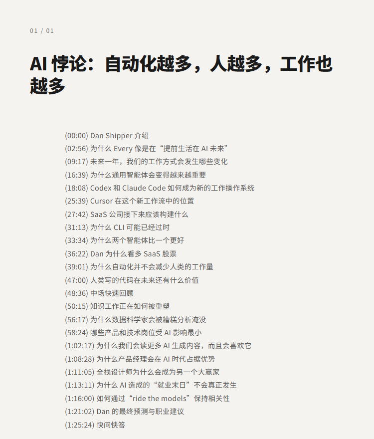
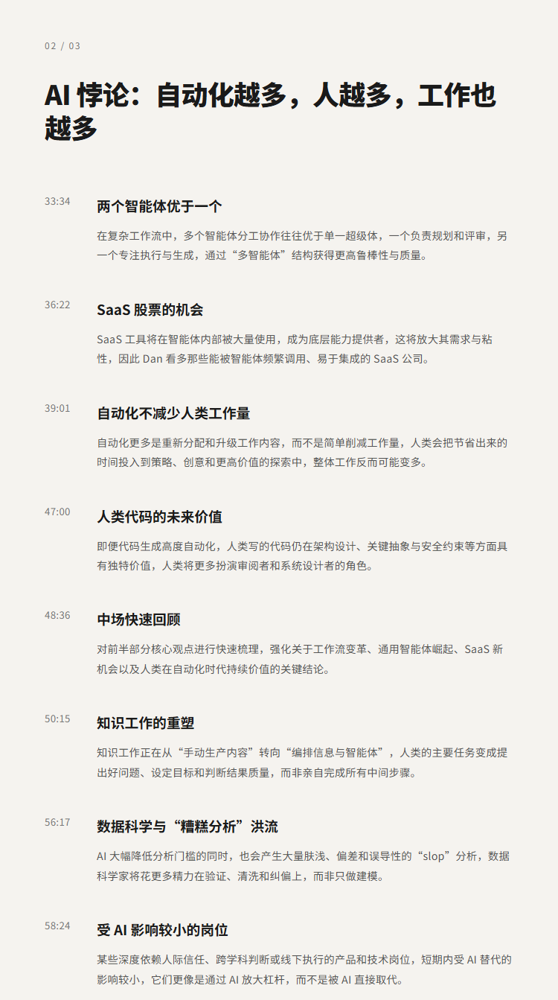

# AI 悖论：自动化越多，人越多，工作也越多

## 洞见目录

- B站标题：AI 悖论：自动化越多，人越多，工作也越多
- 原视频标题：待补充
- B站链接：待补充
- 原视频链接：待补充
- 发布时间：待补充
- 字幕数量：1
- 提纲图数量：4

## 字幕下载

- [字幕 1](subtitles/01_The AI paradox More automation, more humans, more work Dan Shipper - Lenny's Pod.srt)

## 中文时间轴

见 [timeline.md](timeline.md)。

## 提纲图

- 
- 
- 

## 原始简介

见 [bilibili.md](bilibili.md)。
