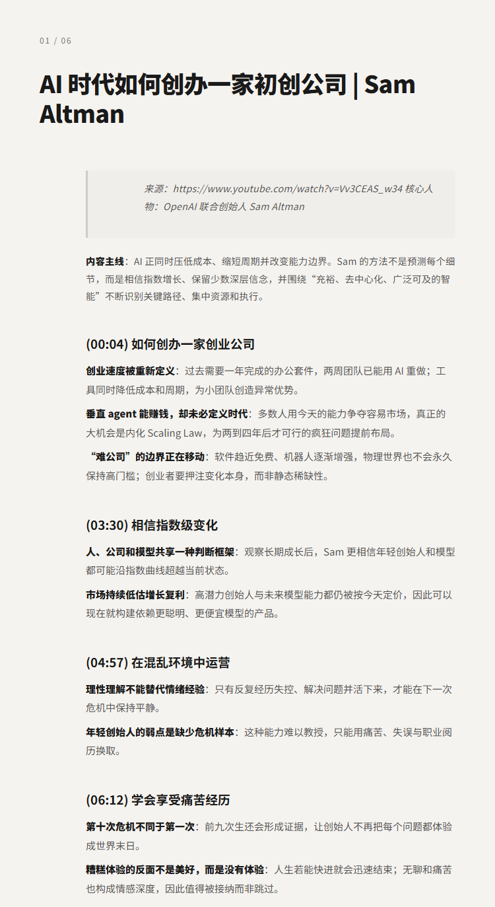
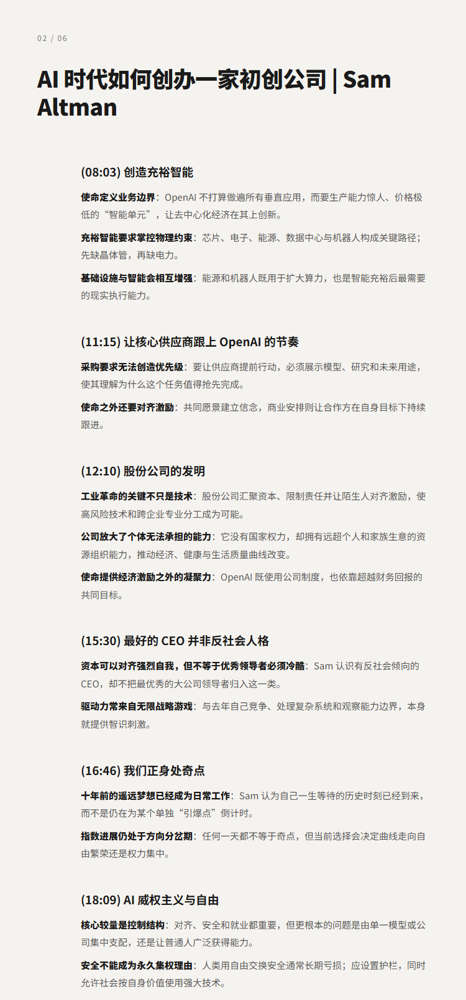
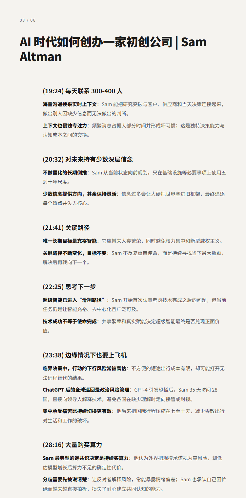

# AI 时代如何创办一家初创公司 | Sam Altman

## 洞见目录

- B站标题：AI 时代如何创办一家初创公司 | Sam Altman
- 原视频标题：Sam Altman - How to Start a Startup
- B站链接：https://www.bilibili.com/video/BV1gRMX6REGo
- 原视频链接：https://www.youtube.com/watch?v=Vv3CEAS_w34
- 发布时间：2026-08-03 16:53:23
- 字幕数量：4
- 提纲图数量：6

## 字幕下载

- [字幕 1](subtitles/Sam Altman.OPUS4-8有翻译参考资料版.双语.中文在上.srt)
- [字幕 2](subtitles/Sam Altman.OPUS4-8术语小修去行尾标点版.有翻译参考资料版.双语.中文在上.srt)
- [字幕 3](subtitles/Sam Altman.OPUS4-8术语小修版.有翻译参考资料版.双语.中文在上.srt)
- [字幕 4](subtitles/Sam Altman.OPUS4.8有翻译参考资料版.双语.中文在上.srt)

## 中文时间轴

见 [timeline.md](timeline.md)。

## 提纲图

- 
- 
- 

## 原始简介

见 [bilibili.md](bilibili.md)。
