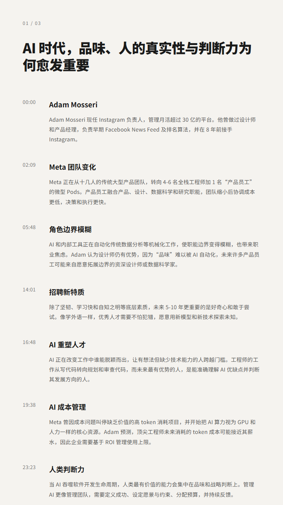
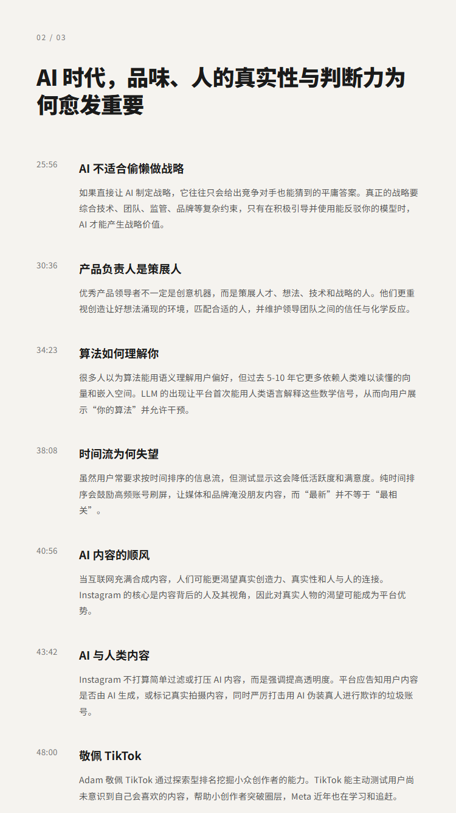
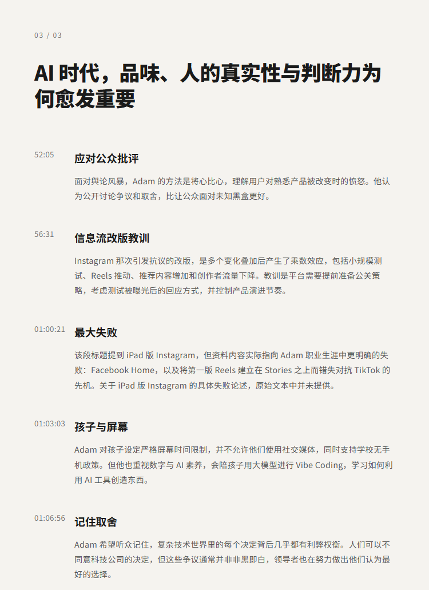

# AI 时代，品味、人的真实性与判断力为何愈发重要 | Adam Mosseri（Instagram 负责人）

## 洞见目录

- B站标题：AI 时代，品味、人的真实性与判断力为何愈发重要 | Adam Mosseri（Instagram 负责人）
- 原视频标题：The rise of taste, human authenticity and judgment in an AI world | Adam Mosseri (Head of IG)
- B站链接：https://www.bilibili.com/video/BV1jEN96tEx1
- 原视频链接：https://www.youtube.com/watch?v=yQ_EWmtfWvQ
- 发布时间：发布时间**: 2026-07-14 16:12:11
- 字幕数量：4
- 提纲图数量：3

## 字幕下载

- [字幕 1](subtitles/The rise of taste, human authenticity and judgment.OPUS4.8参考资料优化版.srt)
- [字幕 2](subtitles/The rise of taste, human authenticity and judgment.OPUS4.8参考资料优化版.品位统一修正版.srt)
- [字幕 3](subtitles/The rise of taste, human authenticity and judgment.OPUS4.8无翻译参考资料版.双语.中文在上.srt)
- [字幕 4](subtitles/The rise of taste, human authenticity and judgment.OPUS4.8无翻译参考资料版.双语.中文在上.去标点版.srt)

## 中文时间轴

见 [timeline.md](timeline.md)。

## 提纲图

- 
- 
- 

## 原始简介

见 [bilibili.md](bilibili.md)。
