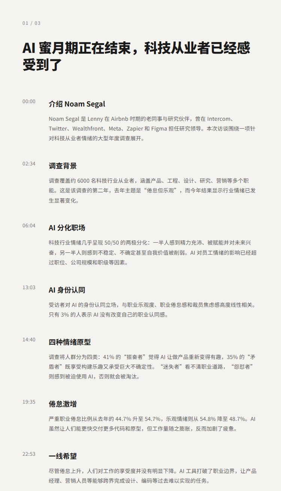
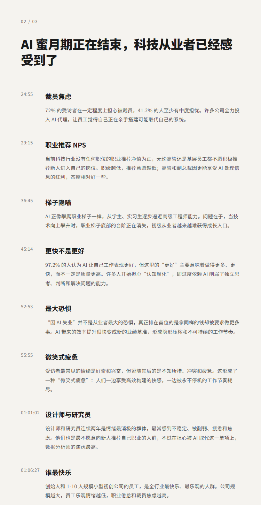
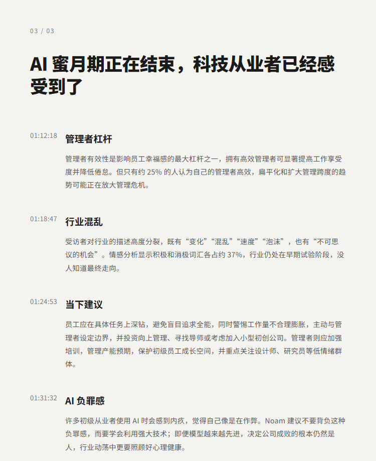

# 观点：美国AI 蜜月期正在结束，科技从业者已经感受到了｜Noam Segal

## 洞见目录

- B站标题：观点：美国AI 蜜月期正在结束，科技从业者已经感受到了｜Noam Segal
- 原视频标题：Why the AI's honeymoon is ending (and tech workers are feeling it) | Noam Segal
- B站链接：https://www.bilibili.com/video/BV1GfKg6NEkm
- 原视频链接：https://www.youtube.com/watch?v=_cmpIveXnvE
- 发布时间：发布时间**: 2026-07-16 11:38:28
- 字幕数量：2
- 提纲图数量：3

## 字幕下载

- [字幕 1](subtitles/Why the tech workforce is quietly splitting in two.OPUS4.8去多余标点修正版.srt)
- [字幕 2](subtitles/Why the tech workforce is quietly splitting in two.OPUS4.8有翻译参考资料版.双语.中文在上.srt)

## 中文时间轴

见 [timeline.md](timeline.md)。

## 提纲图

- 
- 
- 

## 原始简介

见 [bilibili.md](bilibili.md)。
