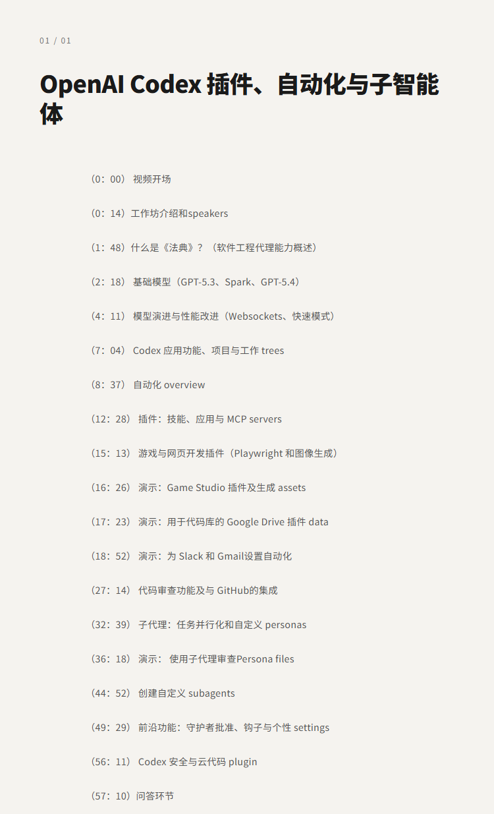
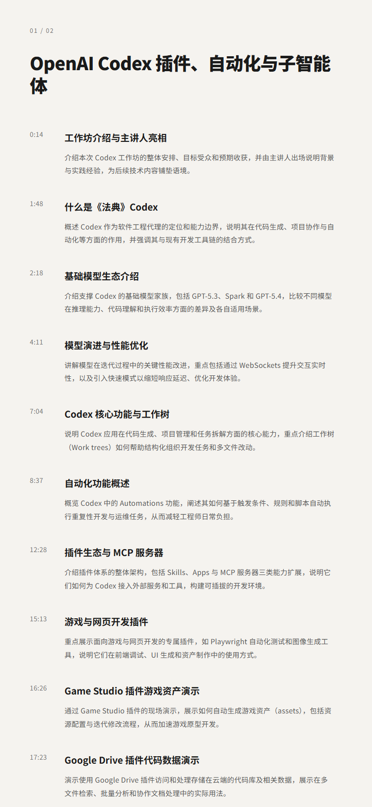
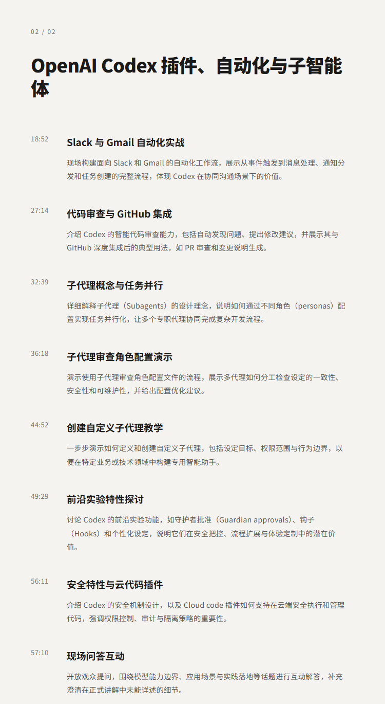

# OpenAI Codex 插件、自动化与子智能体|Vaibhav Srivastav & Katia Gil Guzman

## 洞见目录

- B站标题：OpenAI Codex 插件、自动化与子智能体|Vaibhav Srivastav & Katia Gil Guzman
- 原视频标题：OpenAI Codex Masterclass — Vaibhav Srivastav & Katia Gil Guzman
- B站链接：视频链接**: https://www.bilibili.com/video/BV1gNLq6bEpu
- 原视频链接：https://www.youtube.com/watch?v=MhHEGMFCEB0
- 发布时间：发布时间**: 2026-05-19 18:06:27
- 字幕数量：0
- 提纲图数量：3

## 字幕下载

暂无中文在上字幕，后续补齐。

## 中文时间轴

见 [timeline.md](timeline.md)。

## 提纲图

- 
- 
- 

## 原始简介

见 [bilibili.md](bilibili.md)。
