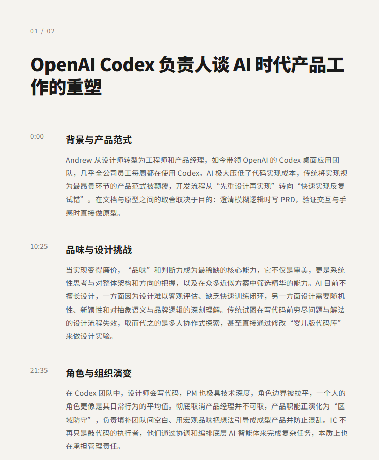
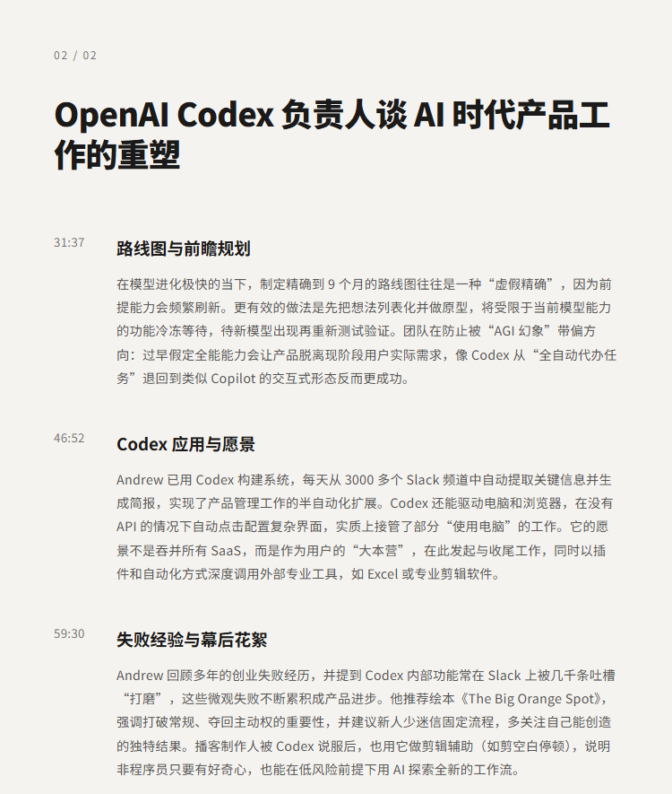

# OpenAI Codex 负责人谈 AI 时代产品工作的重塑 | Andrew Ambrosino

## 洞见目录

- B站标题：OpenAI Codex 负责人谈 AI 时代产品工作的重塑 | Andrew Ambrosino
- 原视频标题：OpenAI Codex lead on the new shape of product work | Andrew Ambrosino
- B站链接：https://www.bilibili.com/video/BV1WKTw6aER5
- 原视频链接：https://www.youtube.com/watch?v=P3KDebPTUrw
- 发布时间：2026-06-30 23:17:16
- 字幕数量：3
- 提纲图数量：2

## 字幕下载

- [字幕 1](subtitles/Why OpenAI is merging Codex and ChatGPT and the.OPUS4.8无翻译参考资料版.双语.中文在上.srt)
- [字幕 2](subtitles/Why OpenAI is merging Codex and ChatGPT and the.OPUS4.8有翻译参考资料版.双语.中文在上.srt)
- [字幕 3](subtitles/Why OpenAI is merging Codex and ChatGPT and the.OPUS4.8有翻译参考资料版.双语.中文在上.去多余标点修正版.srt)

## 中文时间轴

见 [timeline.md](timeline.md)。

## 提纲图

- 
- 

## 原始简介

见 [bilibili.md](bilibili.md)。
