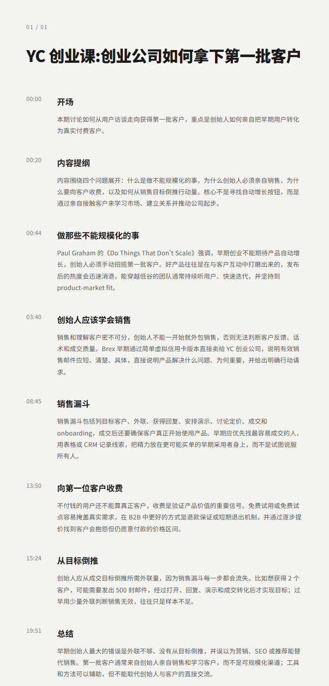

# YC创业课:创业公司如何拿下第一批客户 | Gustaf Alströmer

## 洞见目录

- B站标题：YC创业课:创业公司如何拿下第一批客户 | Gustaf Alströmer
- 原视频标题：How to Get Your First Customers | Startup School
- B站链接：https://www.bilibili.com/video/BV14kK86mEfx
- 原视频链接：https://www.youtube.com/watch?v=hyYCn_kAngI
- 发布时间：发布时间**: 2026-07-21 21:17:19
- 字幕数量：2
- 提纲图数量：1

## 字幕下载

- [字幕 1](subtitles/01_how-to-get-your-first-customers-opus4-8.srt)
- [字幕 2](subtitles/02_how-to-get-your-first-customers-opus4-8.srt)

## 中文时间轴

见 [timeline.md](timeline.md)。

## 提纲图

- 

## 原始简介

见 [bilibili.md](bilibili.md)。
