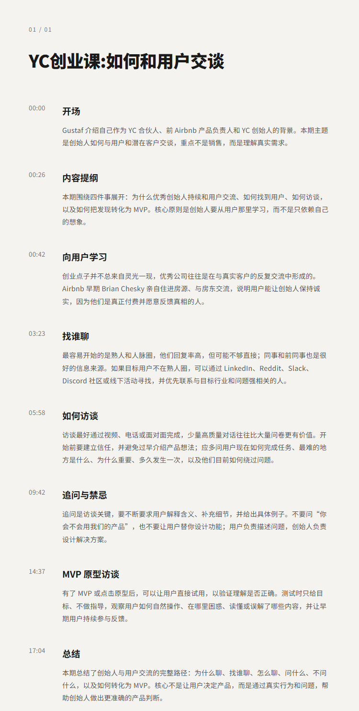

# YC创业课:如何与用户交谈 | Gustaf Alströmer

## 洞见目录

- B站标题：YC创业课:如何与用户交谈 | Gustaf Alströmer
- 原视频标题：How To Talk To Users | Startup School
- B站链接：视频链接**: https://www.bilibili.com/video/BV1y8Kh6yEjh
- 原视频链接：https://www.youtube.com/watch?v=z1iF1c8w5Lg
- 发布时间：发布时间**: 2026-07-21 19:24:08
- 字幕数量：0
- 提纲图数量：1

## 字幕下载

暂无中文在上字幕，后续补齐。

## 中文时间轴

见 [timeline.md](timeline.md)。

## 提纲图

- 

## 原始简介

见 [bilibili.md](bilibili.md)。
