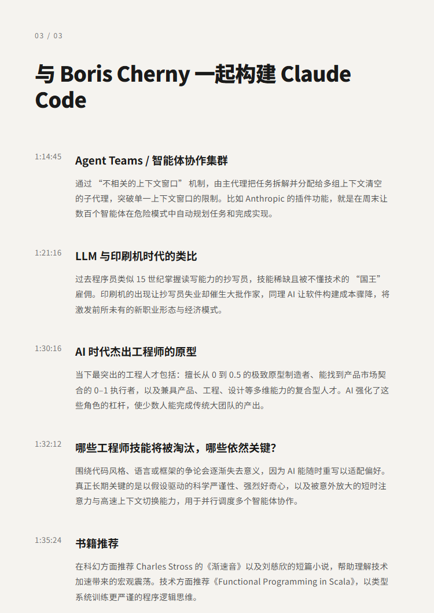

# 与 Boris Cherny 一起构建 Claude Code

## 洞见目录

- B站标题：与 Boris Cherny 一起构建 Claude Code
- 原视频标题：Building Claude Code with Boris Cherny
- B站链接：视频链接**: https://www.bilibili.com/video/BV1YcR1BQERU
- 原视频链接：https://www.youtube.com/watch?v=julbw1JuAz0
- 发布时间：发布时间**: 2026-05-05 21:05:40
- 字幕数量：2
- 提纲图数量：3

## 字幕下载

- [字幕 1](subtitles/01_building-claude-code-with-boris-cherny-the-pragmatic-eng.srt)
- [字幕 2](subtitles/02_head-of-claude-code-what-happens-after-coding-is-solved-.srt)

## 中文时间轴

见 [timeline.md](timeline.md)。

## 提纲图

- 
- 
- 

## 原始简介

见 [bilibili.md](bilibili.md)。
