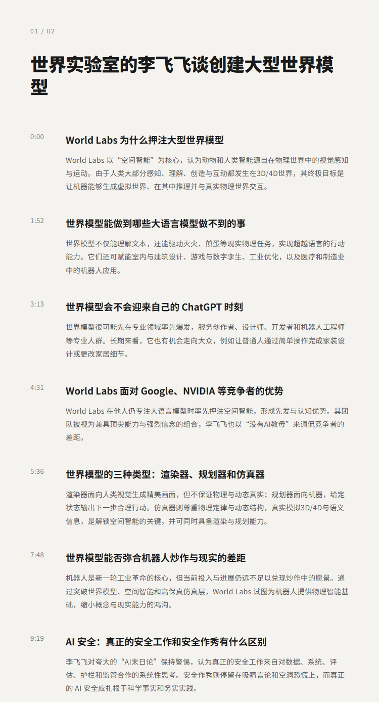
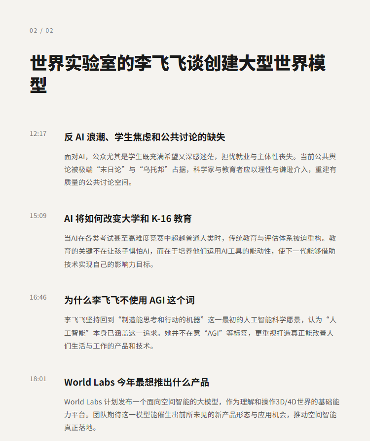

# World Labs 李飞飞谈大型世界模型的构建|李飞飞

## 洞见目录

- B站标题：World Labs 李飞飞谈大型世界模型的构建|李飞飞
- 原视频标题：World Labs' Fei-Fei Li on Creating Large World Models
- B站链接：https://www.bilibili.com/video/BV16gEm62EPD
- 原视频链接：https://www.youtube.com/watch?v=pNYVckbCFuk
- 发布时间：2026-06-09 21:12:42
- 字幕数量：0
- 提纲图数量：2

## 字幕下载

暂无中文在上字幕，后续补齐。

## 中文时间轴

见 [timeline.md](timeline.md)。

## 提纲图

- 
- 

## 原始简介

见 [bilibili.md](bilibili.md)。
