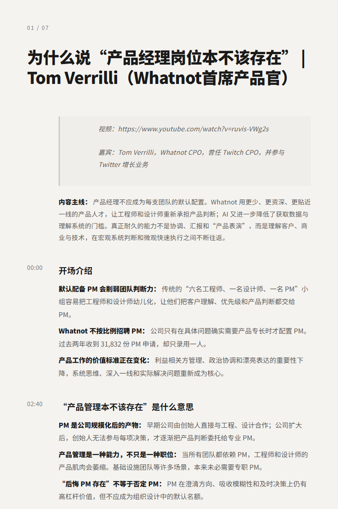
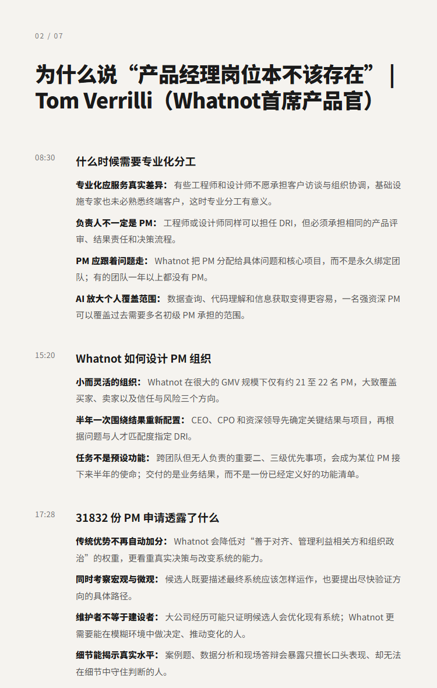
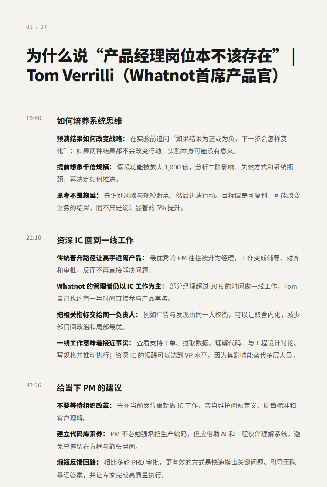

# 为什么说“产品经理岗位本不该存在” | Tom Verrilli（Whatnot首席产品官）

## 洞见目录

- B站标题：为什么说“产品经理岗位本不该存在” | Tom Verrilli（Whatnot首席产品官）
- 原视频标题：This CPO regrets that product management exists | Tom Verrilli (CPO of Whatnot)
- B站链接：https://www.bilibili.com/video/BV1xHuw6uEqC
- 原视频链接：待补充
- 发布时间：发布时间**: 2026-08-04 15:47:49
- 字幕数量：1
- 提纲图数量：7

## 字幕下载

- [字幕 1](subtitles/01_术语小修-去多余行尾标点版.srt)

## 中文时间轴

见 [timeline.md](timeline.md)。

## 提纲图

- 
- 
- 

## 原始简介

见 [bilibili.md](bilibili.md)。
