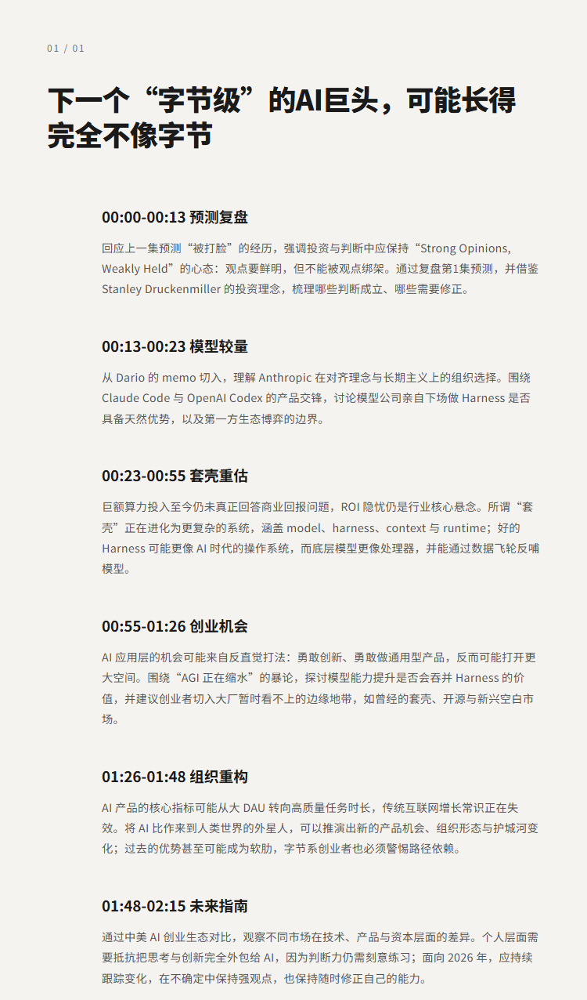
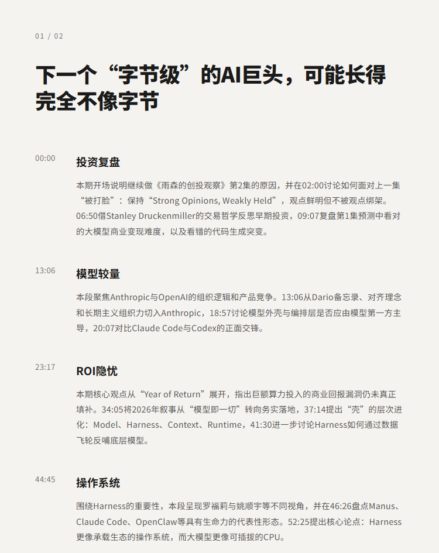
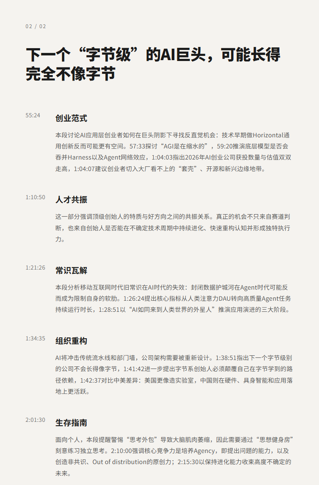

# 下一个“字节级”的AI巨头，可能长得完全不像字节|戴雨森

## 洞见目录

- B站标题：下一个“字节级”的AI巨头，可能长得完全不像字节|戴雨森
- 原视频标题：142. 雨森的创投观察第2集：Harness、下一个字节、2026大机会和Stanley Druckenmiller
- B站链接：https://www.bilibili.com/video/BV1Q8Vz6AEe6
- 原视频链接：https://www.youtube.com/watch?v=XEhf371Aeso
- 发布时间：2026-06-02 16:32:45
- 字幕数量：0
- 提纲图数量：3

## 字幕下载

暂无中文在上字幕，后续补齐。

## 中文时间轴

见 [timeline.md](timeline.md)。

## 提纲图

- 
- 
- 

## 原始简介

见 [bilibili.md](bilibili.md)。
