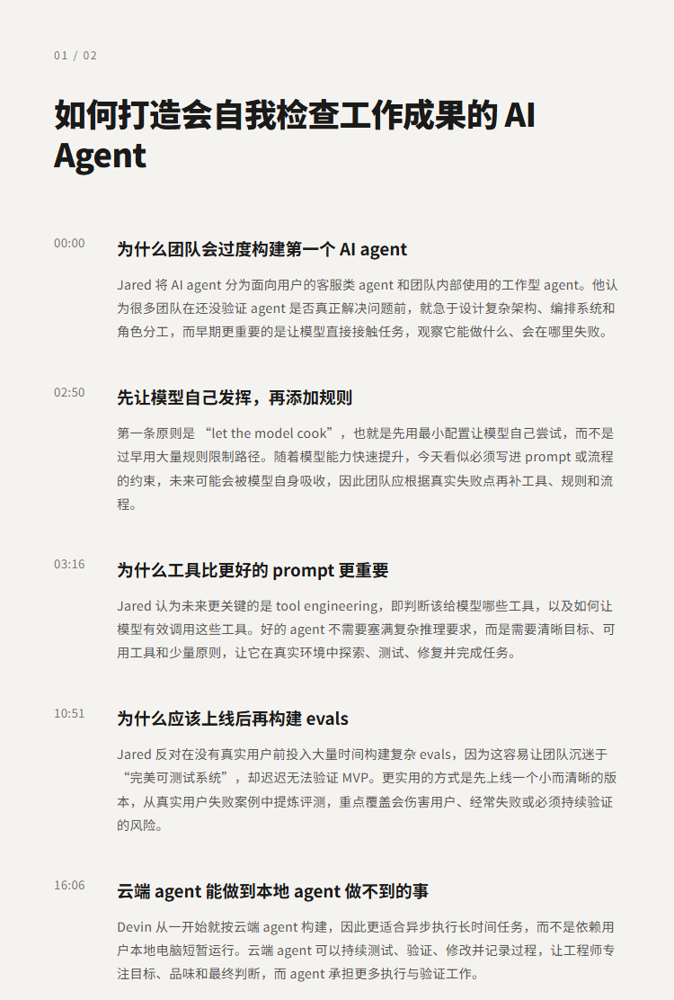
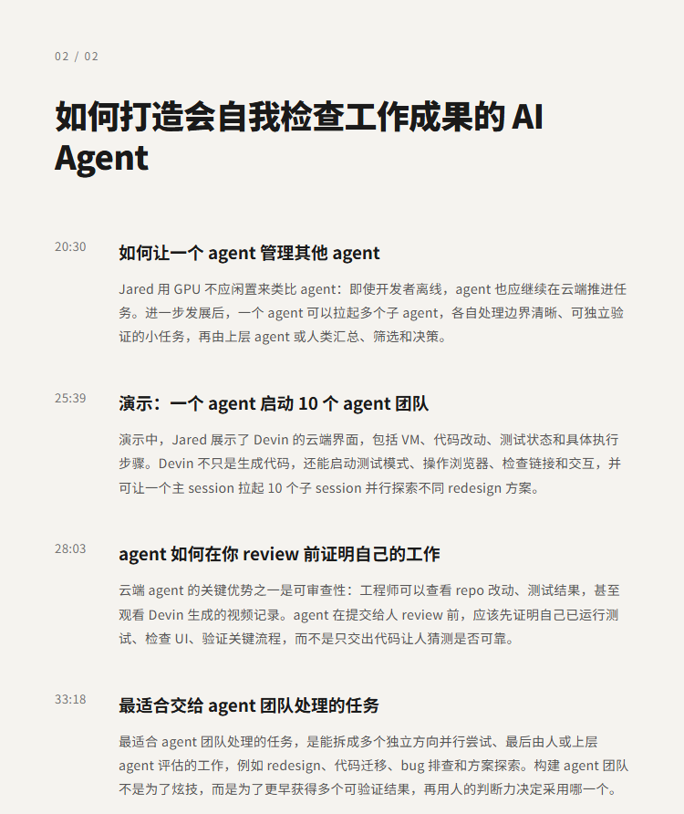

# 如何打造会自我检查工作成果的 AI Agent | Jared Zoneraich

## 洞见目录

- B站标题：如何打造会自我检查工作成果的 AI Agent | Jared Zoneraich
- 原视频标题：How to Build AI Agents That Check Their Own Work | Jared Zoneraich
- B站链接：https://www.bilibili.com/video/BV1Jb3v68Esq
- 原视频链接：待补充
- 发布时间：发布时间**: 2026-07-28 16:18:42
- 字幕数量：2
- 提纲图数量：2

## 字幕下载

- [字幕 1](subtitles/01_how-to-build-ai-agents-that-check-their-own-work-opus4-8.srt)
- [字幕 2](subtitles/02_how-to-build-ai-agents-that-check-their-own-work-opus4-8.srt)

## 中文时间轴

见 [timeline.md](timeline.md)。

## 提纲图

- 
- 

## 原始简介

见 [bilibili.md](bilibili.md)。
