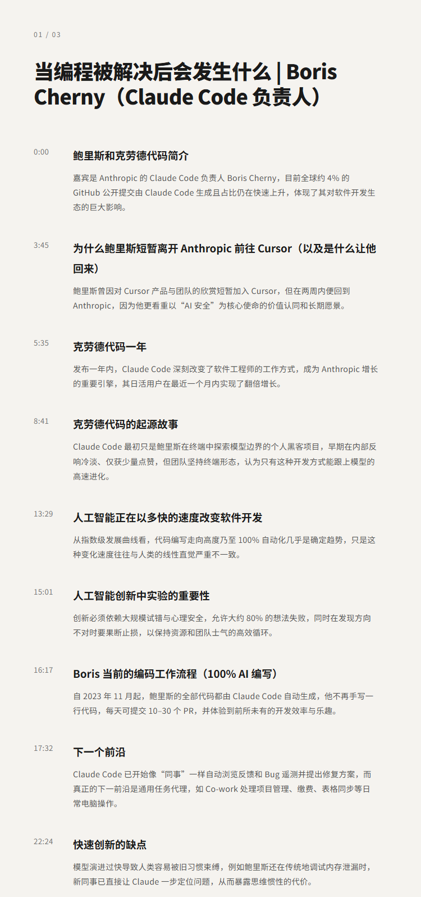
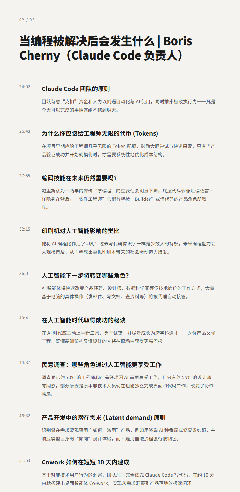
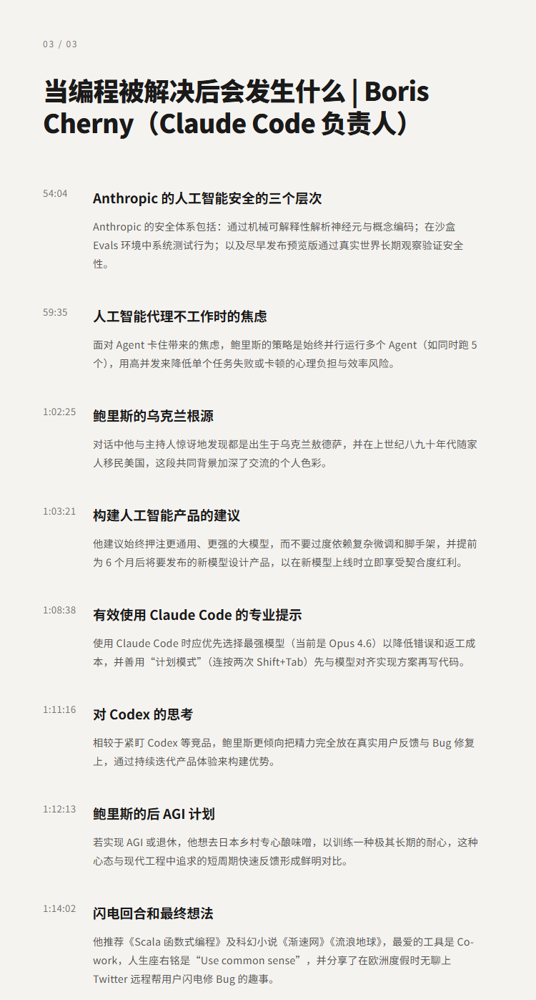

# 当编程被终结后会发生什么？ | Boris Cherny（Claude Code 负责人）

## 洞见目录

- B站标题：当编程被终结后会发生什么？ | Boris Cherny（Claude Code 负责人）
- 原视频标题：Head of Claude Code: What happens after coding is solved | Boris Cherny
- B站链接：视频链接**: https://www.bilibili.com/video/BV1E9RcBqEVc
- 原视频链接：https://www.youtube.com/watch?v=We7BZVKbCVw
- 发布时间：发布时间**: 2026-05-03 22:28:11
- 字幕数量：1
- 提纲图数量：3

## 字幕下载

- [字幕 1](subtitles/01_head-of-claude-code-what-happens-after-coding-is-solved-.srt)

## 中文时间轴

见 [timeline.md](timeline.md)。

## 提纲图

- 
- 
- 

## 原始简介

见 [bilibili.md](bilibili.md)。
