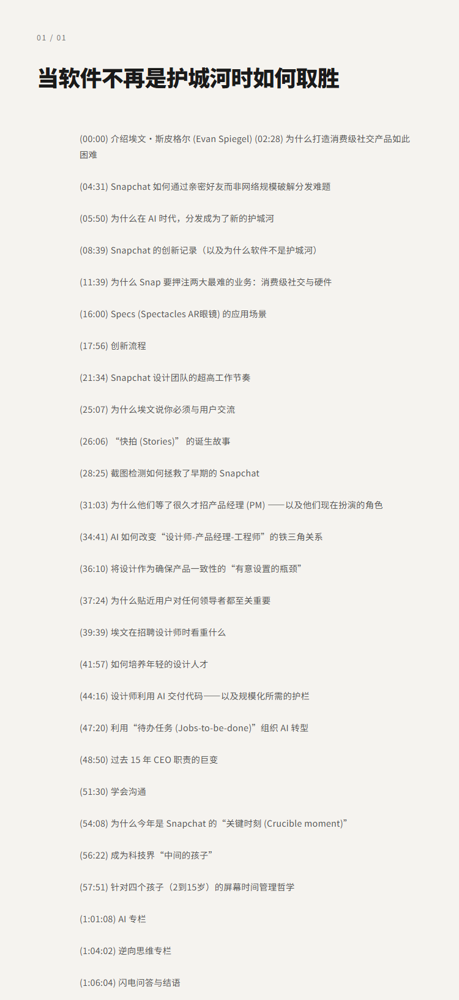
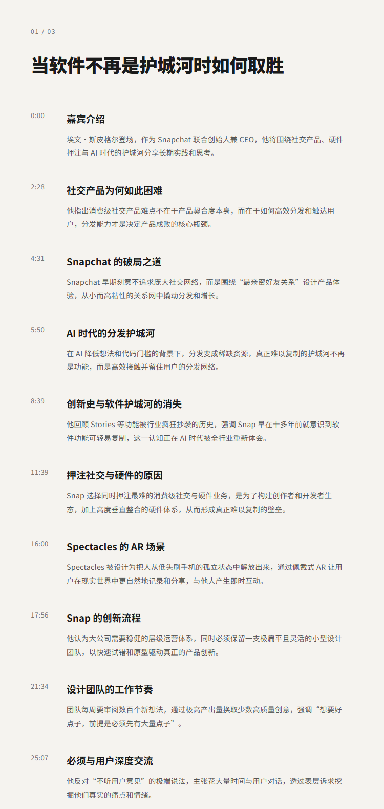
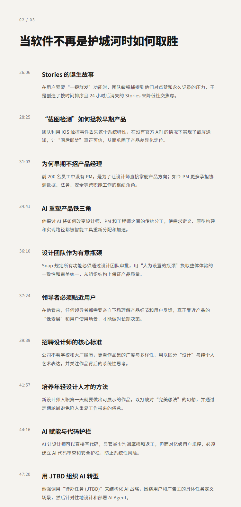

# 当软件不再是护城河时如何取胜 | Evan Spiegel (Snapchat CEO)

## 洞见目录

- B站标题：当软件不再是护城河时如何取胜 | Evan Spiegel (Snapchat CEO)
- 原视频标题：How to win when software is not a moat | Evan Spiegel (Snapchat CEO)
- B站链接：视频链接**: https://www.bilibili.com/video/BV1xeLP68Ety
- 原视频链接：https://www.youtube.com/watch?v=-7Yol5vX5xw
- 发布时间：发布时间**: 2026-05-18 20:41:15
- 字幕数量：1
- 提纲图数量：4

## 字幕下载

- [字幕 1](subtitles/01_how-to-win-when-software-is-not-a-moat-evan-spiegel-snap.srt)

## 中文时间轴

见 [timeline.md](timeline.md)。

## 提纲图

- 
- 
- 

## 原始简介

见 [bilibili.md](bilibili.md)。
