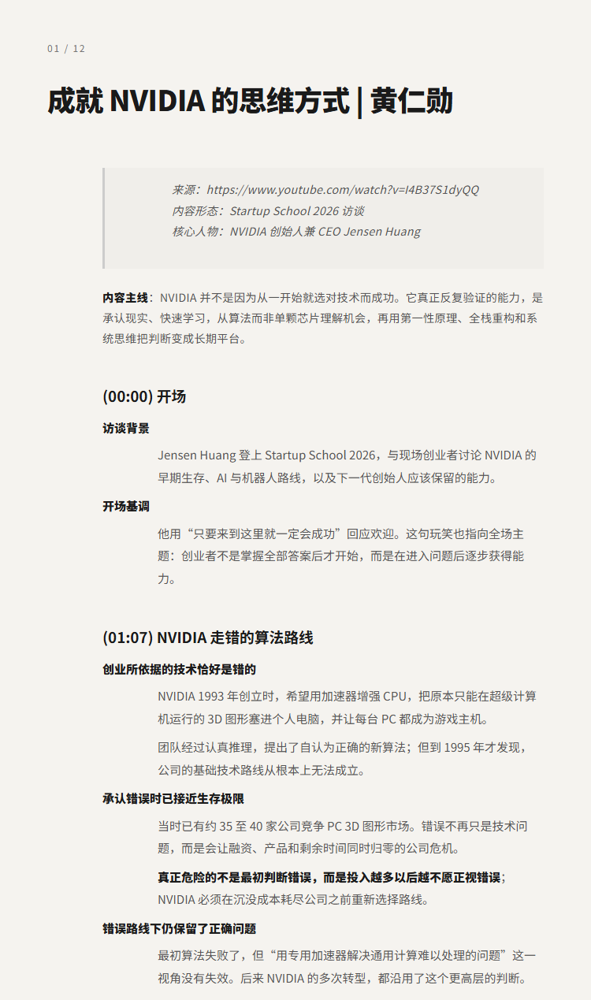
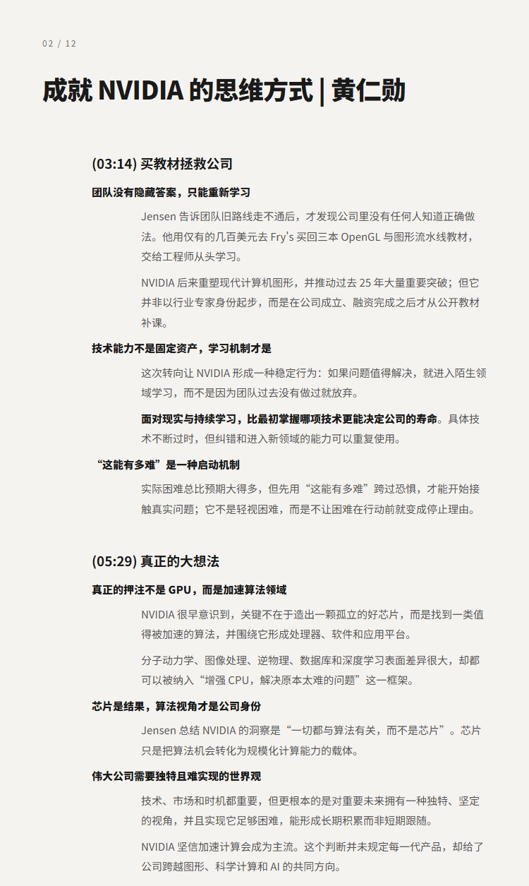
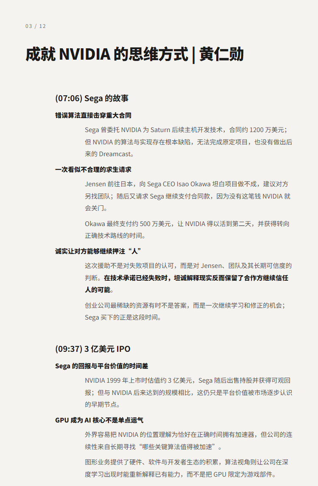

# 成就 NVIDIA 的思维方式 | 黄仁勋

## 洞见目录

- B站标题：成就 NVIDIA 的思维方式 | 黄仁勋
- 原视频标题：Jensen Huang: The Mindset That Built NVIDIA
- B站链接：视频链接**: https://www.bilibili.com/video/BV1PTGG6gEky
- 原视频链接：待补充
- 发布时间：发布时间**: 2026-08-01 21:45:11
- 字幕数量：2
- 提纲图数量：12

## 字幕下载

- [字幕 1](subtitles/01_jensen-huang-the-mindset-that-built-nvidia-opus4-8-no-en.srt)
- [字幕 2](subtitles/02_jensen-huang-the-mindset-that-built-nvidia-opus4-8.srt)

## 中文时间轴

见 [timeline.md](timeline.md)。

## 提纲图

- 
- 
- 

## 原始简介

见 [bilibili.md](bilibili.md)。
