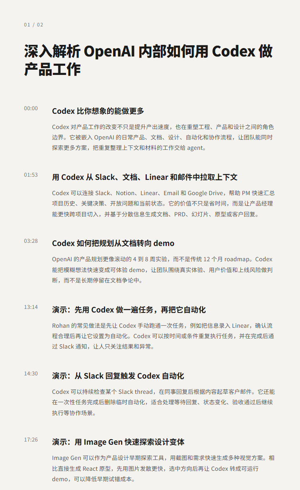
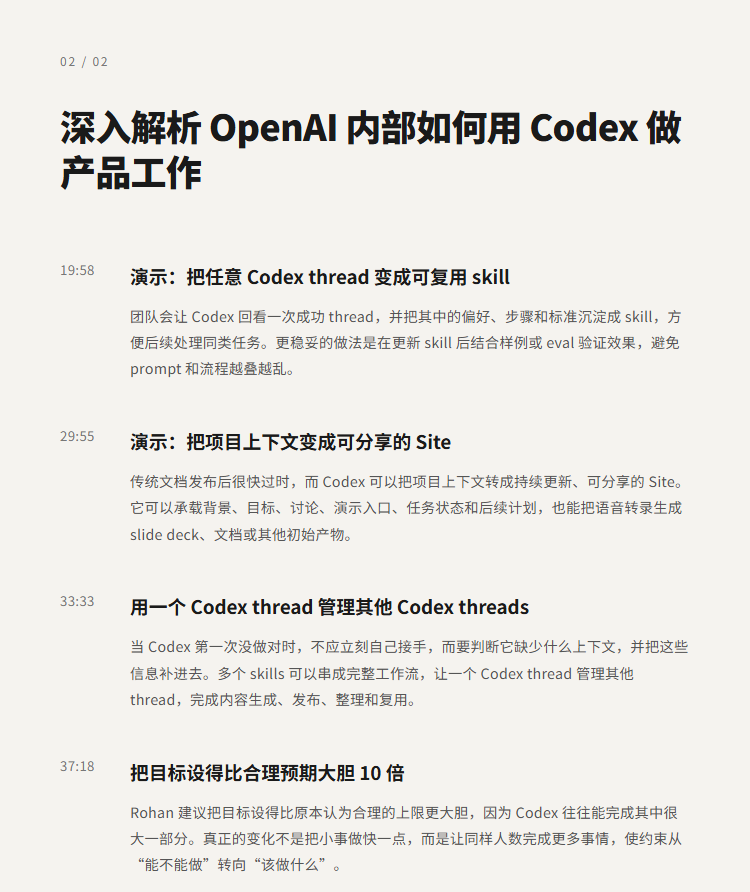

# 深入解析 OpenAI 内部如何用 Codex 做产品工作 | Rohan Varma

## 洞见目录

- B站标题：深入解析 OpenAI 内部如何用 Codex 做产品工作 | Rohan Varma
- 原视频标题：Inside How OpenAI Uses Codex to Do Product Work | Rohan Varma
- B站链接：https://www.bilibili.com/video/BV1Ei3q6YEnK
- 原视频链接：https://www.youtube.com/watch?v=fAdFE7y6K2o
- 发布时间：2026-07-28 19:49:26
- 字幕数量：2
- 提纲图数量：2

## 字幕下载

- [字幕 1](subtitles/Inside How OpenAI Uses Codex to Do Product Work.OPUS4.8无翻译参考资料版.双语.中文在上.参考资料检查去多余标点版.srt)
- [字幕 2](subtitles/Inside How OpenAI Uses Codex to Do Product Work.OPUS4.8无翻译参考资料版.双语.中文在上.srt)

## 中文时间轴

见 [timeline.md](timeline.md)。

## 提纲图

- 
- 

## 原始简介

见 [bilibili.md](bilibili.md)。
