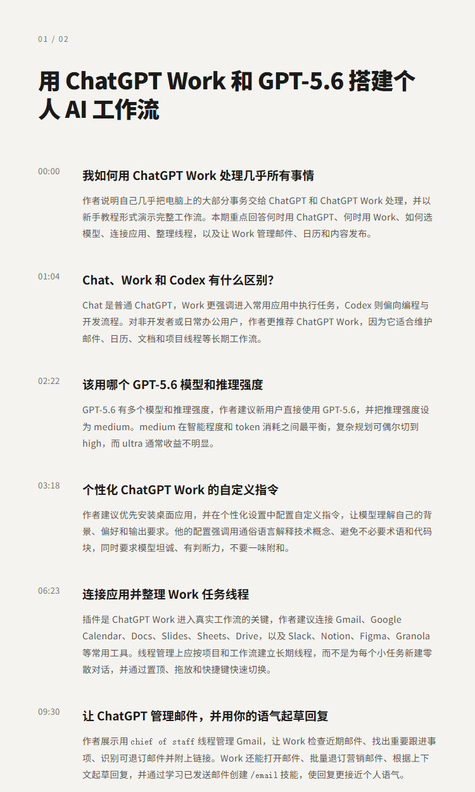
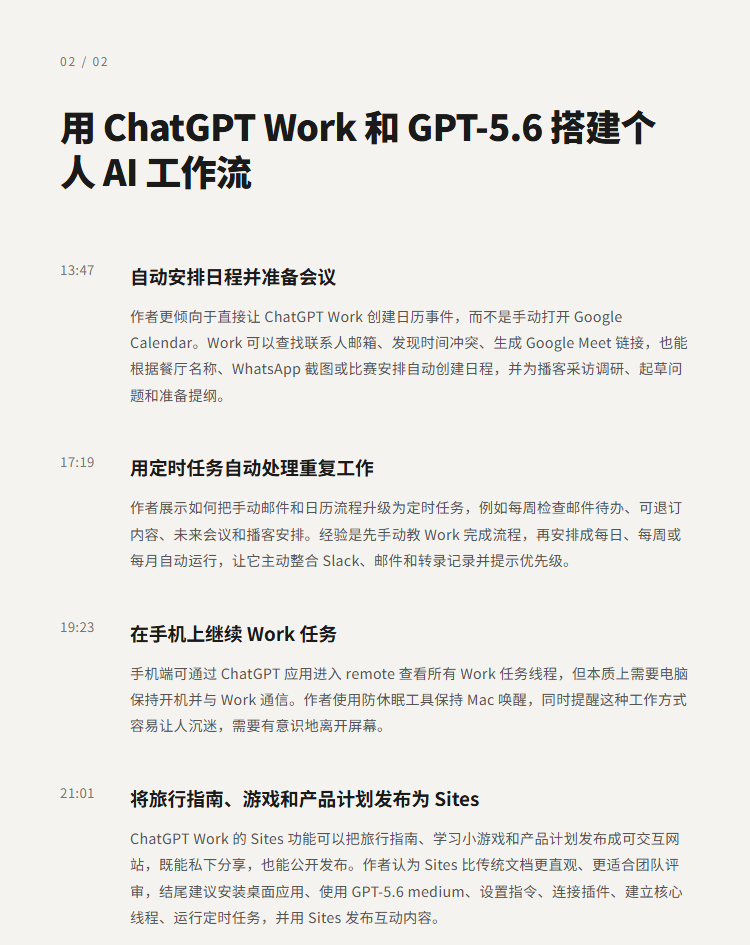

# 用 ChatGPT Work 和 GPT-5.6 搭建个人 AI 工作流｜Peter Yang

## 洞见目录

- B站标题：用 ChatGPT Work 和 GPT-5.6 搭建个人 AI 工作流｜Peter Yang
- 原视频标题：How I Use ChatGPT Work and GPT-5.6 to Do Everything (Beginner Tutorial)
- B站链接：https://www.bilibili.com/video/BV19p3i6pEL7
- 原视频链接：https://www.youtube.com/watch?v=WLg9qWOf6zw
- 发布时间：发布时间**: 2026-07-28 14:05:01
- 字幕数量：0
- 提纲图数量：2

## 字幕下载

暂无中文在上字幕，后续补齐。

## 中文时间轴

见 [timeline.md](timeline.md)。

## 提纲图

- 
- 

## 原始简介

见 [bilibili.md](bilibili.md)。
