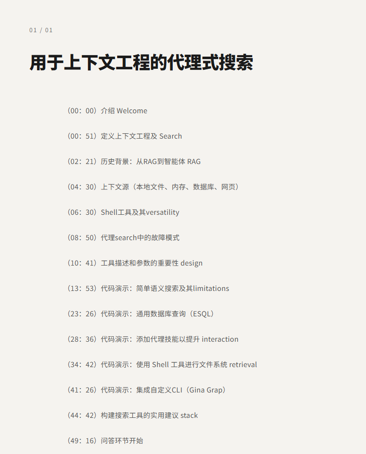
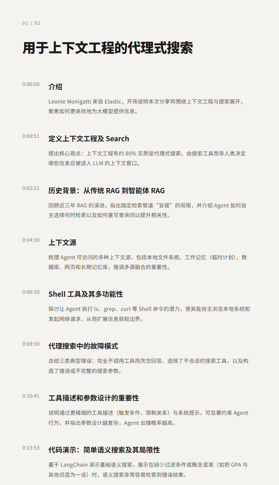

# 用于上下文工程的代理式搜索|Leonie Monigatti

## 洞见目录

- B站标题：用于上下文工程的代理式搜索|Leonie Monigatti
- 原视频标题：Agentic Search for Context Engineering — Leonie Monigatti, Elastic
- B站链接：https://www.bilibili.com/video/BV1ujLu67Epr
- 原视频链接：https://www.youtube.com/watch?v=ynJyIKwjonM
- 发布时间：发布时间**: 2026-05-19 11:56:07
- 字幕数量：1
- 提纲图数量：3

## 字幕下载

- [字幕 1](subtitles/01_agentic-search-for-context-engineering-leonie-monigatti-.srt)

## 中文时间轴

见 [timeline.md](timeline.md)。

## 提纲图

- 
- 
- 

## 原始简介

见 [bilibili.md](bilibili.md)。
