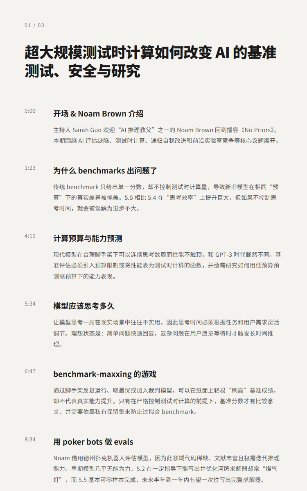
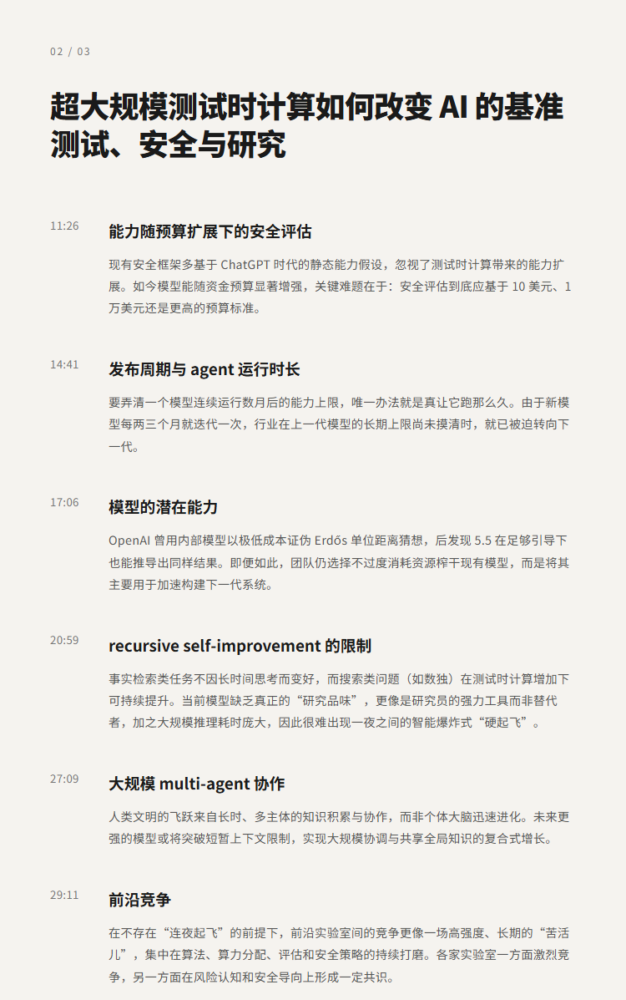
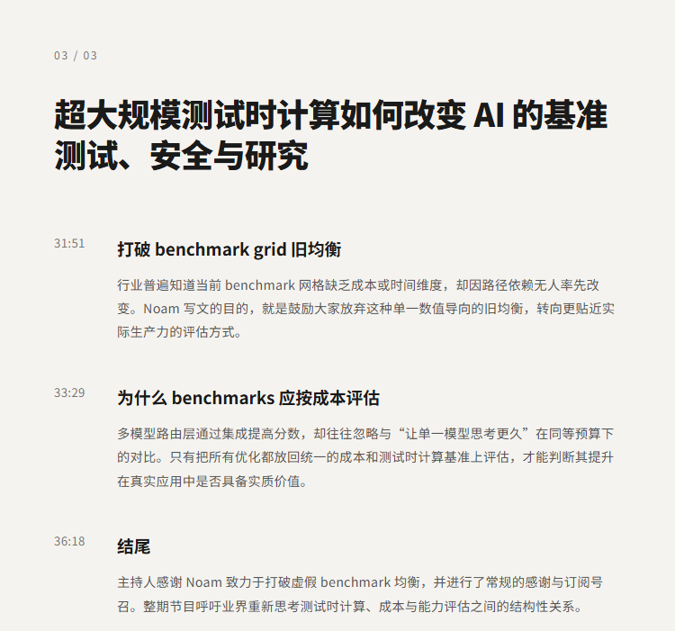

# 超大规模测试时计算如何改变 AI 的基准测试、安全与研究 | Noam Brown(OpenAI）

## 洞见目录

- B站标题：超大规模测试时计算如何改变 AI 的基准测试、安全与研究 | Noam Brown(OpenAI）
- 原视频标题：Really Big Test-Time Compute in AI Changes Benchmarks, Safety and Research with OpenAI's Noam Brown
- B站链接：https://www.bilibili.com/video/BV1caM86GEqL
- 原视频链接：https://www.youtube.com/watch?v=AZrU6y3pUcU
- 发布时间：2026-07-07 17:11:23
- 字幕数量：0
- 提纲图数量：3

## 字幕下载

暂无中文在上字幕，后续补齐。

## 中文时间轴

见 [timeline.md](timeline.md)。

## 提纲图

- 
- 
- 

## 原始简介

见 [bilibili.md](bilibili.md)。
