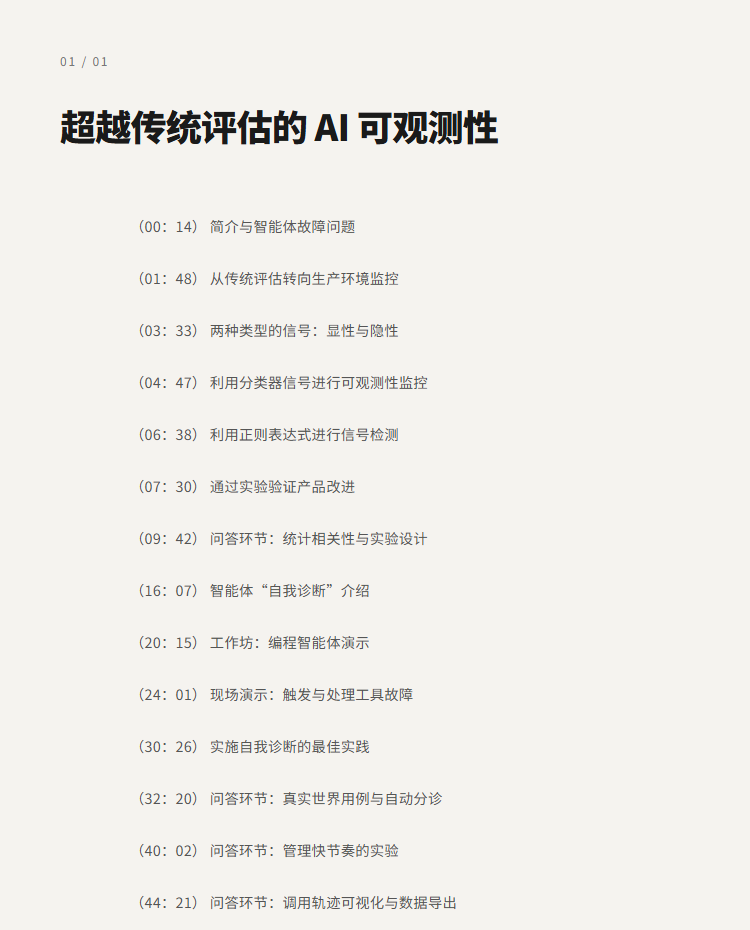
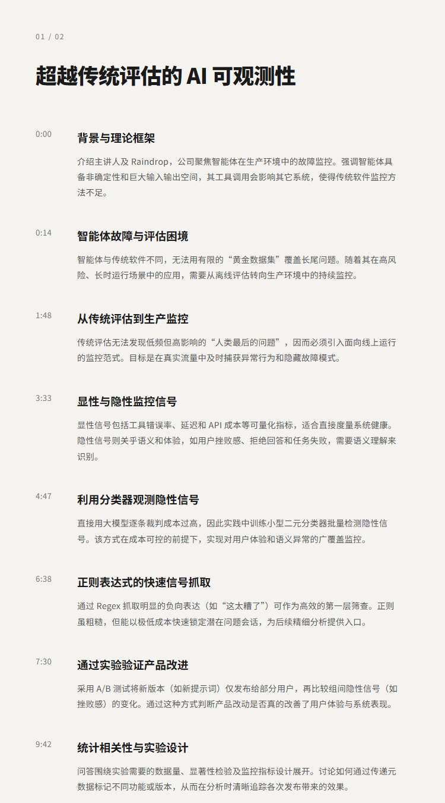
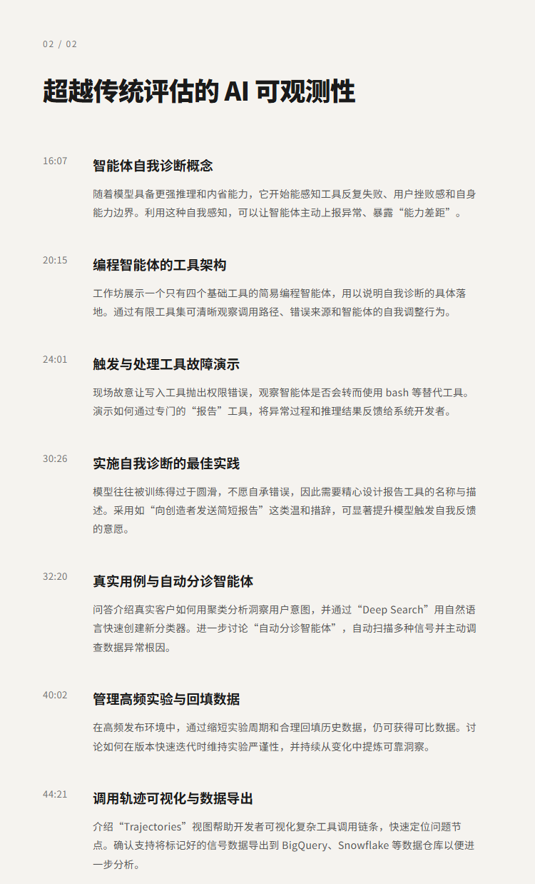

# 超越传统评估的 AI 可观测性 | Danny Gollapalli&Zubin Koticha

## 洞见目录

- B站标题：超越传统评估的 AI 可观测性 | Danny Gollapalli&Zubin Koticha
- 原视频标题：Full Workshop: AI Observability Beyond Evals — Danny Gollapalli & Zubin Koticha, Raindrop
- B站链接：https://www.bilibili.com/video/BV11c536GEG3
- 原视频链接：https://www.youtube.com/watch?v=-aM2EDTiaMs
- 发布时间：发布时间**: 2026-05-13 01:34:56
- 字幕数量：1
- 提纲图数量：4

## 字幕下载

- [字幕 1](subtitles/Everything You Need To Know About Agent Observability — Danny Gollapalli & Zubin Koticha, Raindrop - AI Engineer (1080p, h264, youtube)_final.srt)

## 中文时间轴

见 [timeline.md](timeline.md)。

## 提纲图

- 
- 
- 

## 原始简介

见 [bilibili.md](bilibili.md)。
