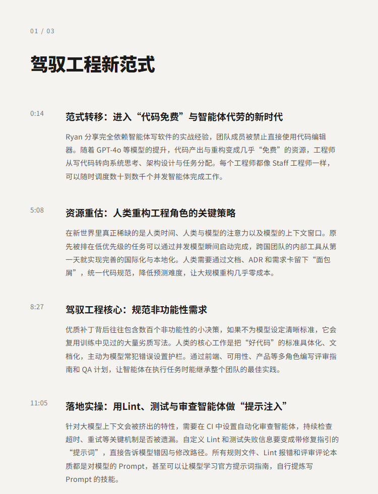
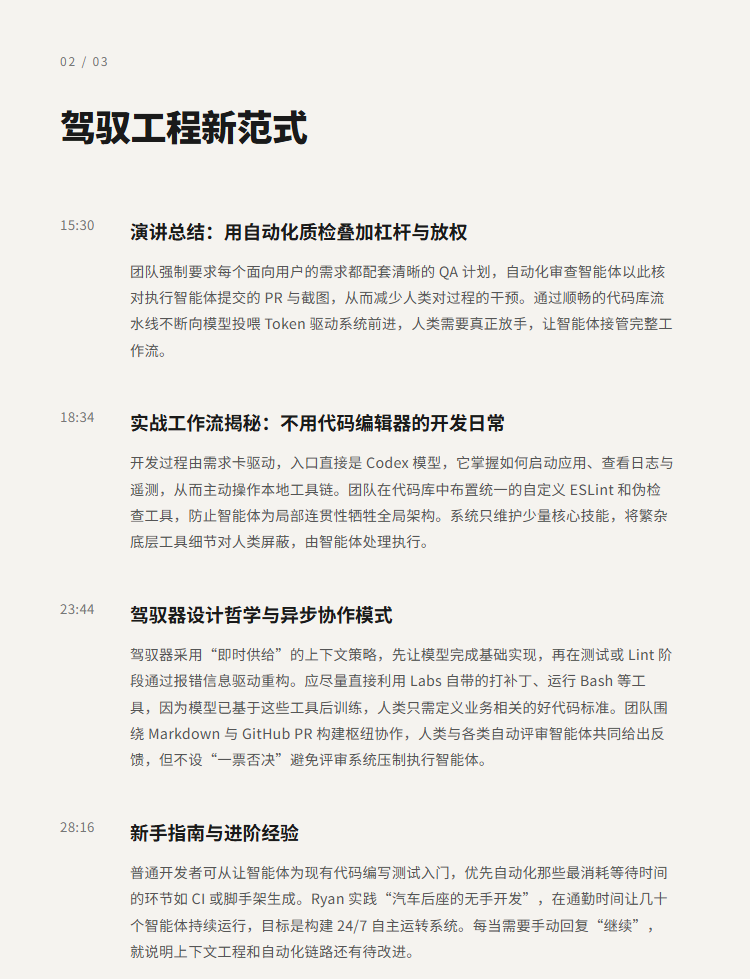
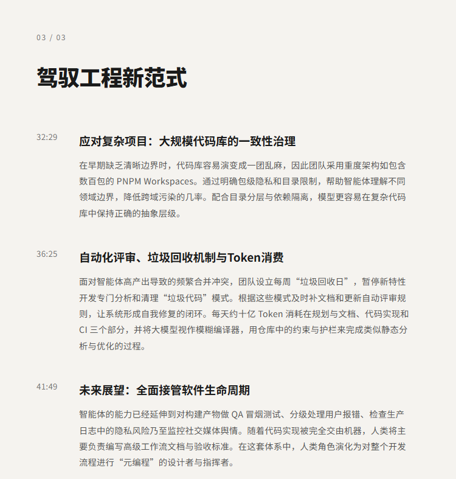

# 驾驭工程：人类当主管，智能体敲代码，如何重塑软件开发|Ryan Lopopolo, OpenAI

## 洞见目录

- B站标题：驾驭工程：人类当主管，智能体敲代码，如何重塑软件开发|Ryan Lopopolo, OpenAI
- 原视频标题：Harness Engineering: How to Build Software When Humans Steer, Agents Execute — Ryan Lopopolo, OpenAI
- B站链接：视频链接**: https://www.bilibili.com/video/BV1U3dQBwEkH
- 原视频链接：https://www.youtube.com/watch?v=am_oeAoUhew
- 发布时间：发布时间**: 2026-04-21 23:38:41
- 字幕数量：1
- 提纲图数量：3

## 字幕下载

- [字幕 1](subtitles/01_harness-engineering-how-to-build-software-when-humans-st.srt)

## 中文时间轴

见 [timeline.md](timeline.md)。

## 提纲图

- 
- 
- 

## 原始简介

见 [bilibili.md](bilibili.md)。
