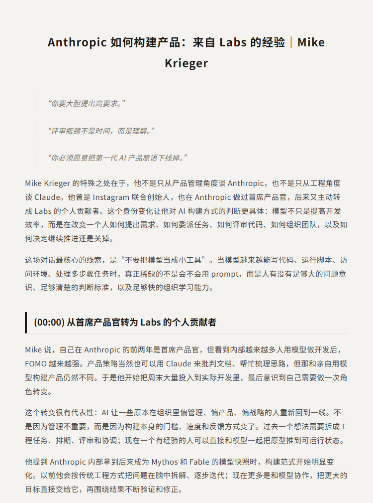
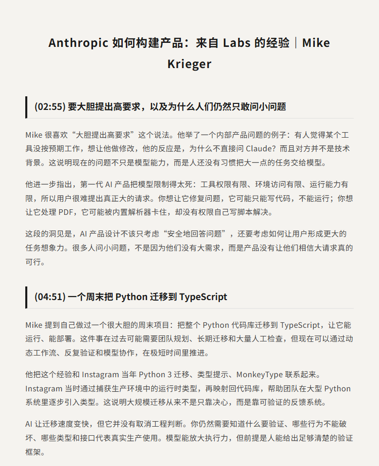
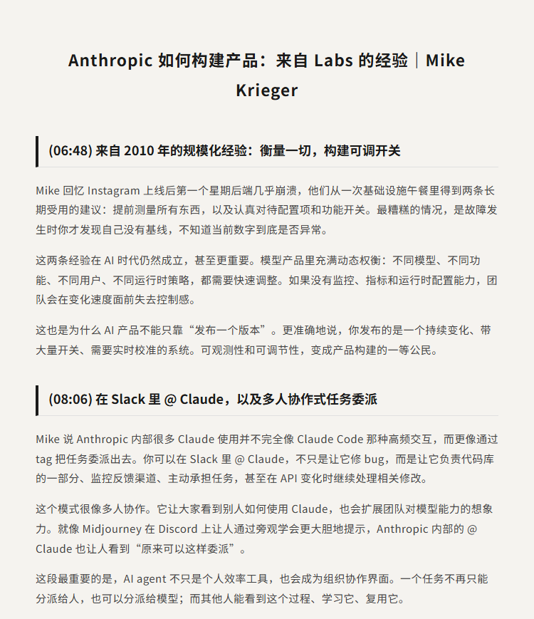
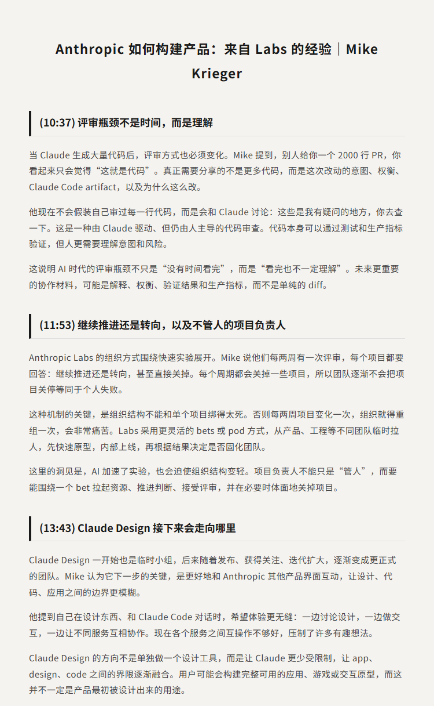
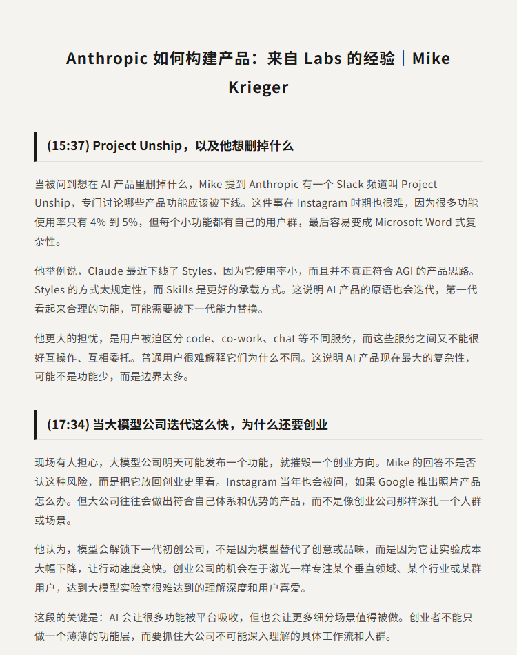
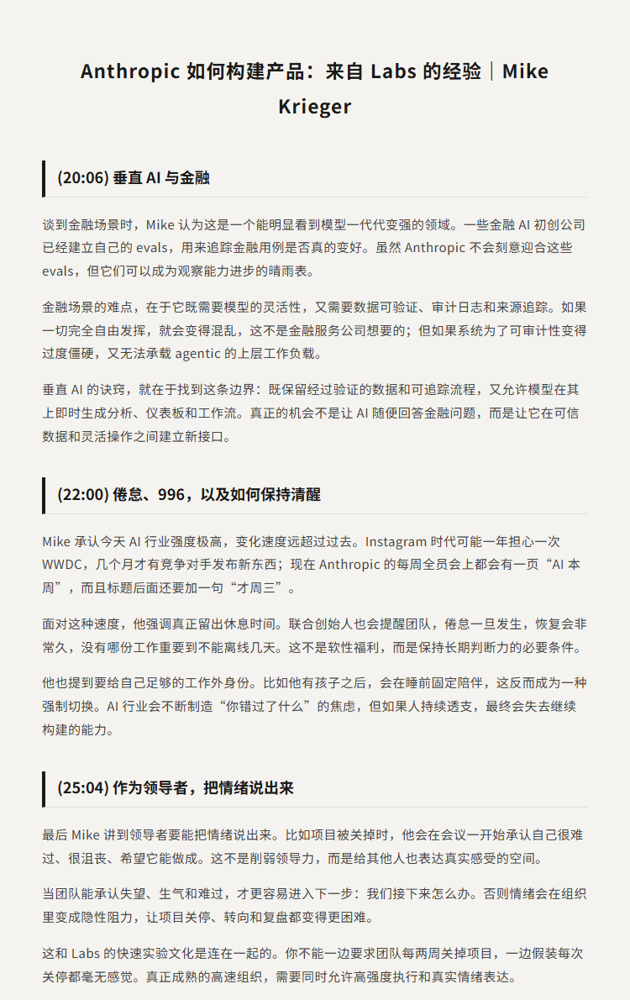
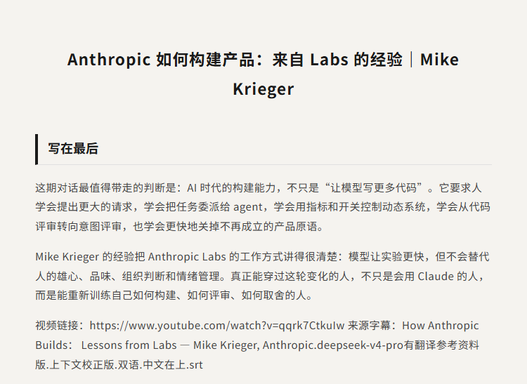

# Anthropic 如何构建产品：来自 Labs 的经验｜Mike Krieger

原视频：How Anthropic Builds: Lessons from Labs — Mike Krieger, Anthropic

YouTube：https://www.youtube.com/watch?v=qqrk7CtkuIw

B站：https://www.bilibili.com/video/BV1v6bG6vEeb/

## 简介

这期是 Mike Krieger 在 AI Engineer 现场分享 Anthropic Labs 构建方式的一场对话。Mike 曾是 Instagram 联合创始人，也曾担任 Anthropic 首席产品官，后来主动转为 Labs 的个人贡献者。他从自己的角色变化讲起，解释为什么 AI 时代的产品构建不只是让模型写更多代码，而是要重新训练人如何提出更大的请求、如何委派任务、如何评审结果，以及如何在组织里快速推进或关掉一个实验。

最核心的主题是：不要把模型当成小工具。当 Claude 能写代码、运行脚本、访问环境、处理多步骤任务时，真正稀缺的变成了人的问题意识、判断标准和验证框架。Mike 用一个周末把 Python 代码库迁移到 TypeScript 的例子说明，模型可以大幅放大执行力，但前提是人知道什么要验证、哪些行为不能破坏、哪些权衡需要被看见。

这场分享也谈到 Anthropic Labs 的组织方式：两周一次 persevere or pivot 评审，项目可以快速组队、内部上线，也可以被正常关掉。AI 加速了实验，也迫使组织结构变轻。评审的瓶颈不再只是有没有时间读完代码，而是人是否理解改动意图、风险、验证结果和产品取舍。

## 看点

1. Mike Krieger 为什么从 Anthropic CPO 转到 Labs 做个人贡献者
2. 为什么 AI 产品要鼓励用户提出更大的请求
3. 一个周末把 Python 代码库迁移到 TypeScript 的经验
4. 2010 年 Instagram 规模化经验在 AI 时代为什么仍然重要
5. 在 Slack 里 @ Claude 带来的多人协作式任务委派
6. 为什么代码评审的瓶颈正在从时间变成理解
7. Anthropic Labs 如何用两周节奏决定继续推进还是转向
8. Claude Design、Project Unship 与 AI 产品原语的下线
9. 大模型公司高速迭代时，创业公司的垂直机会在哪里
10. 高强度 AI 行业里如何面对倦怠和真实情绪

## 字幕下载

- [双语字幕](subtitles/How Anthropic Builds Lessons from Labs Mike Krieger Anthropic.deepseek-v4-pro.context-corrected.bilingual.zh-top.srt)

## 中文时间轴

见 [timeline.md](timeline.md)。

## 完整提纲

见 [outline.md](outline.md)。

## 提纲图

- 
- 
- 
- 
- 
- 
- 

## 原始简介

见 [bilibili.md](bilibili.md)。
