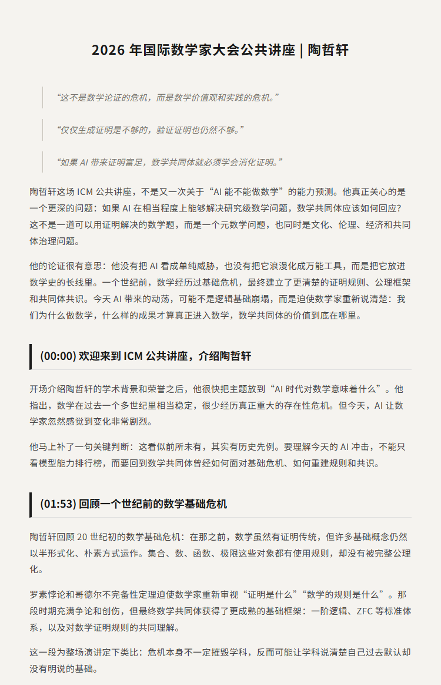
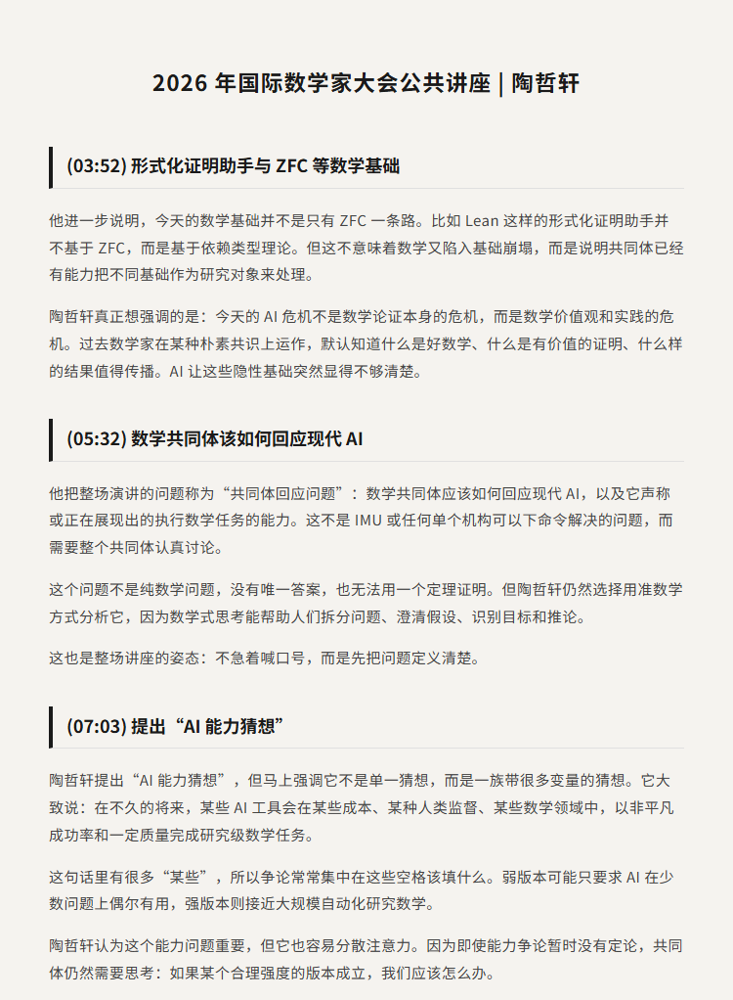
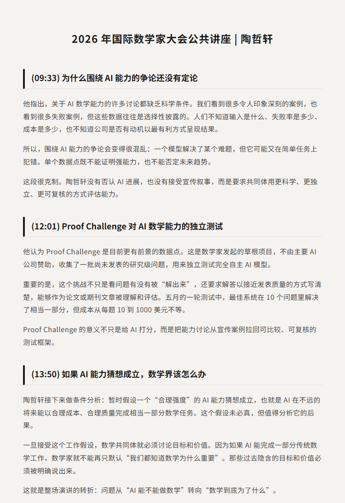
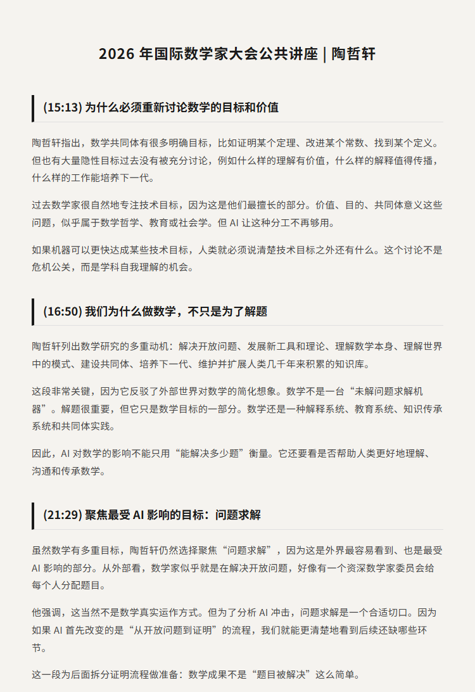
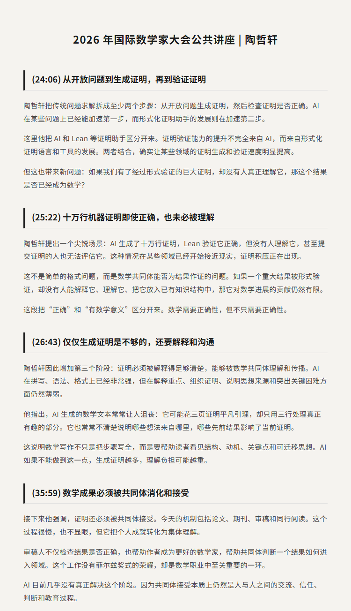
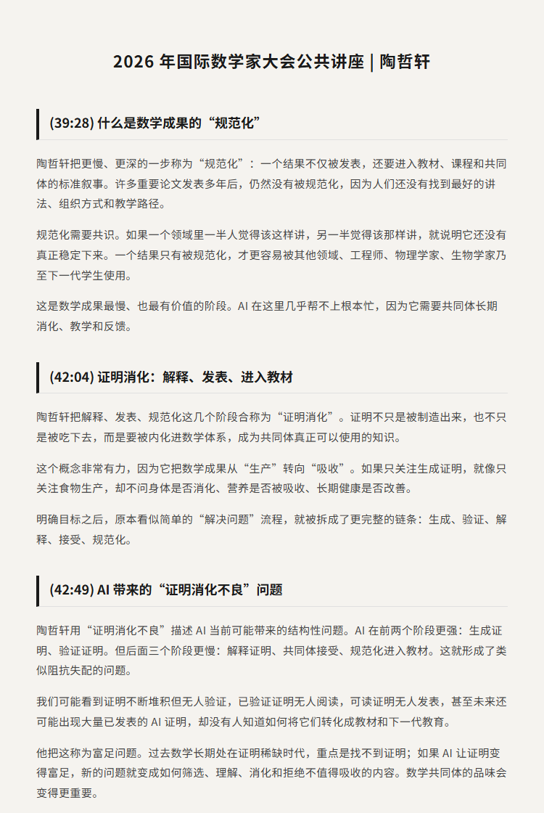
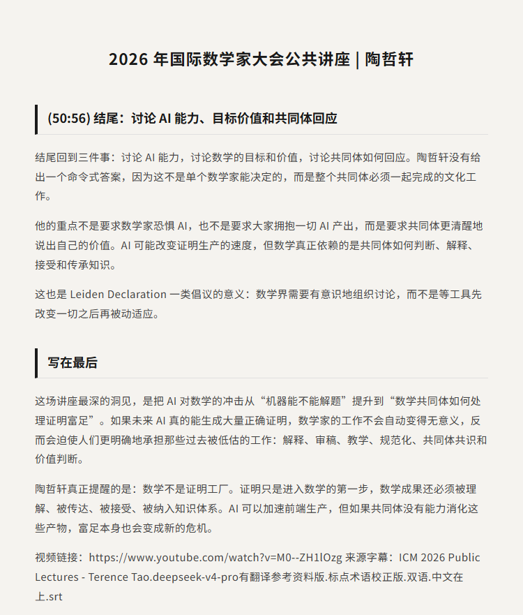

# 陶哲轩：AI 时代的数学共同体回应｜ICM 2026

原视频：ICM 2026 Public Lectures - Terence Tao

副标题：Mathematics in the Age of AI

YouTube：https://www.youtube.com/watch?v=M0--ZH1lOzg

B站：https://www.bilibili.com/video/BV1rCYs6dEtG/

## 简介

这期是陶哲轩在 ICM 2026 公共讲座中的分享，主题是 AI 时代的数学。它不是又一次简单讨论“AI 能不能证明定理”，而是把问题往前推进了一层：如果 AI 真的能在某些研究级数学任务上生成正确证明，数学共同体应该如何回应？

陶哲轩把今天的 AI 冲击放进数学史的长线里。一个世纪前，罗素悖论、哥德尔不完备性定理和形式基础问题迫使数学家重新澄清“证明是什么”。今天的危机不再主要是数学论证本身的危机，而是数学价值观和实践的危机：什么样的成果值得进入数学？什么样的证明需要被理解、传播、发表和规范化？

这场讲座最有价值的判断，是把 AI 对数学的影响从“证明生产”转向“证明消化”。生成证明和验证证明都还不够，一个数学成果还必须被解释、被共同体接受、被纳入教材和标准叙事。AI 可能带来证明富足，而富足之后真正稀缺的，是共同体的理解力、品味、审稿、教学和价值判断。

## 看点

1. 为什么陶哲轩认为 AI 不是数学论证危机，而是数学实践危机
2. 一个世纪前数学基础危机如何帮助理解今天的 AI 冲击
3. “AI 能力猜想”为什么必须拆成更精确的问题
4. Proof Challenge 如何为 AI 数学能力提供独立测试框架
5. 为什么数学不只是解决开放问题
6. 从开放问题到证明生成、验证、解释、发表和规范化
7. 十万行机器证明即使正确，为什么仍然可能没有数学意义
8. 什么是数学成果的“证明消化”
9. AI 可能带来的不是证明稀缺，而是证明富足后的消化不良
10. 数学共同体为什么需要重新说清楚自己的目标和价值

## 字幕下载

- [双语字幕](subtitles/ICM 2026 Public Lectures - Terence Tao.deepseek-v4-pro.term-punctuation-corrected.bilingual.zh-top.srt)

## 中文时间轴

见 [timeline.md](timeline.md)。

## 完整提纲

见 [outline.md](outline.md)。

## 提纲图

- 
- 
- 
- 
- 
- 
- 

## 原始简介

见 [bilibili.md](bilibili.md)。
