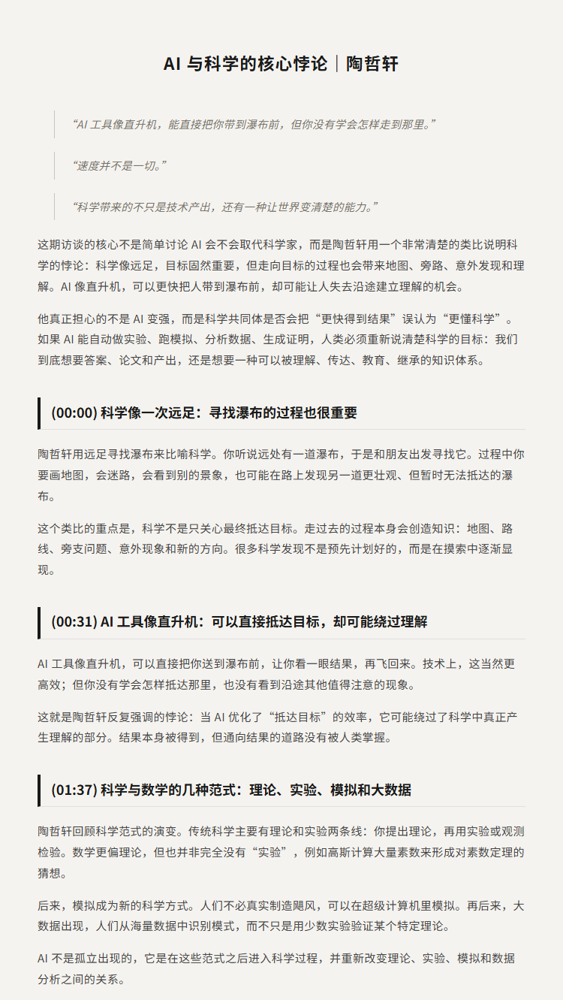
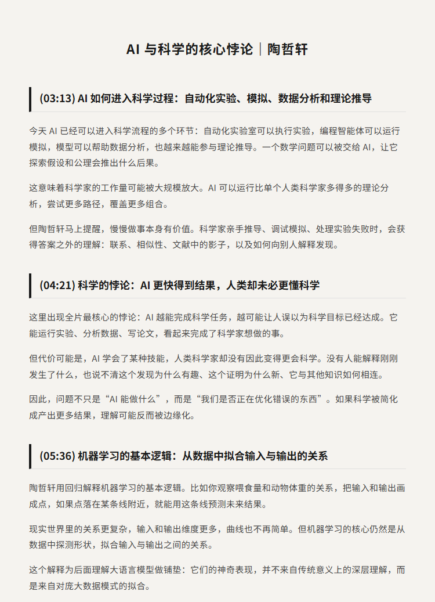
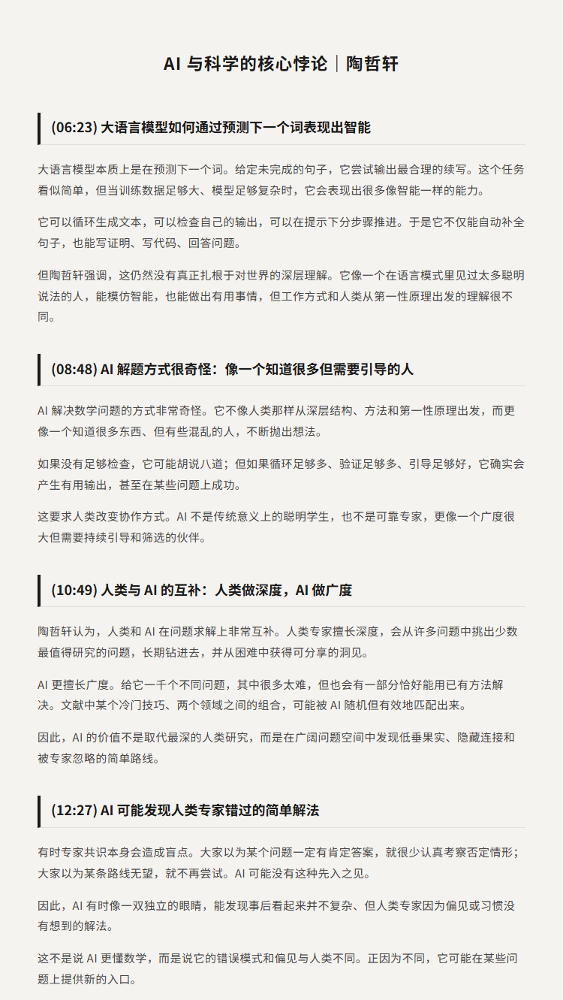
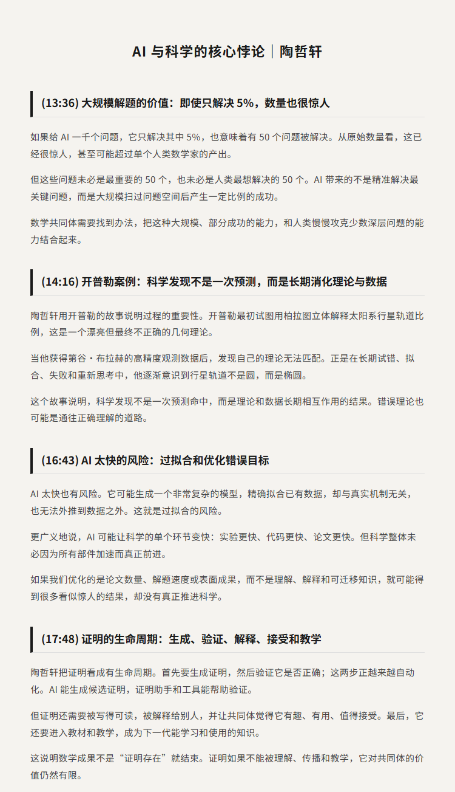
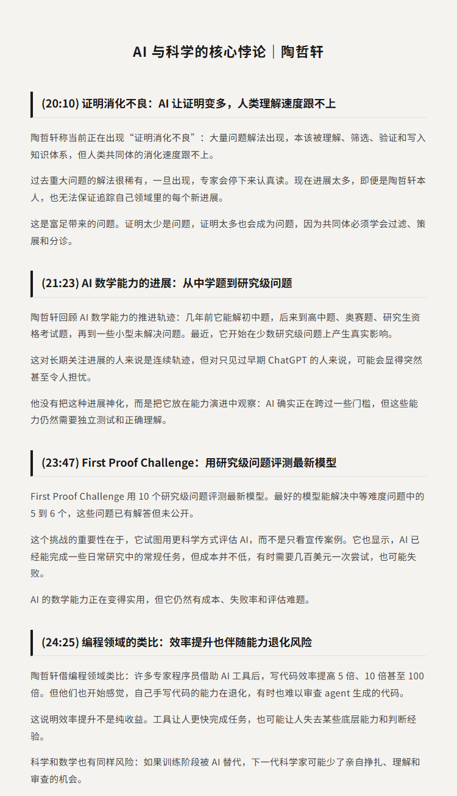
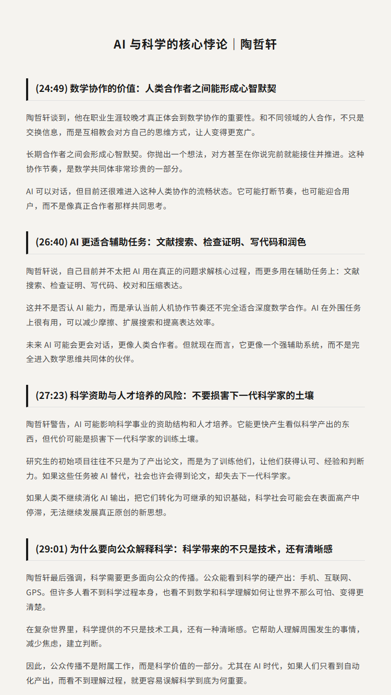
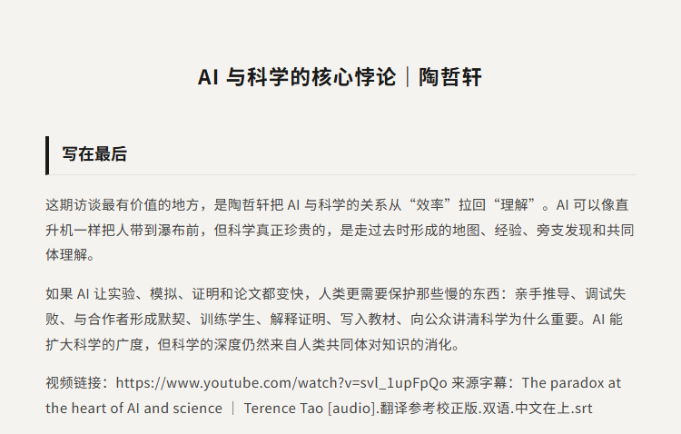

# AI 与科学的核心悖论｜陶哲轩

原视频：The paradox at the heart of AI and science | Terence Tao

YouTube：https://www.youtube.com/watch?v=svl_1upFpQo

B站：https://www.bilibili.com/video/BV1fZY76AEGo/

## 简介

AI 正在越来越快地生成证明、验证证明、分析数据、运行模拟，甚至提出候选理论。但陶哲轩提醒我们：科学不只是更快得到答案。真正重要的是，人类能不能理解答案为什么成立，为什么重要，以及它如何进入共同体的知识体系。

这期 Big Think Clips 里，陶哲轩用“远足寻找瀑布”来解释科学发现：人类在走向目标的过程中会迷路、画地图、发现意外风景；而 AI 像直升机，可以直接把你送到瀑布前。效率提高了，但探索过程里的理解、判断和训练可能也被绕过了。

最值得看的是他提出的“证明消化不良”：AI 让数学证明的生成和验证变快，但人类理解、整理、讲清楚、写进教材和培养下一代科学家的速度没有同步提升。对关心 AI、科学研究、数学、教育和知识生产的人来说，这是一期非常重要的提醒。

## 看点

1. 陶哲轩用“远足、瀑布、直升机”的比喻解释 AI 对科学发现的影响
2. AI 能加速实验、模拟、数据分析和理论推导，但不等于真正理解
3. 大语言模型本质上仍是在预测下一个词，却能在足够数据和检查下产生有用结果
4. 人类专家擅长深度，AI 擅长广度，两者在科学研究中更像互补关系
5. 开普勒的故事说明，科学发现需要时间消化，不能只看短期预测准确度
6. AI 生成证明越来越多，数学共同体正在面临“证明消化不良”
7. AI 在数学上进步很快，但可复现性、成本和成功率仍然不透明
8. AI 可以提升编程和研究效率，但也可能削弱人的手工能力与判断力
9. 科学不能只优化产出，还要保护培养下一代科学家的土壤

## 字幕下载

- [双语字幕](subtitles/The paradox at the heart of AI and science - Terence Tao.reference-corrected.bilingual.zh-top.srt)

## 中文时间轴

见 [timeline.md](timeline.md)。

## 完整提纲

见 [outline.md](outline.md)。

## 提纲图

- 
- 
- 
- 
- 
- 
- 

## 原始简介

见 [bilibili.md](bilibili.md)。
