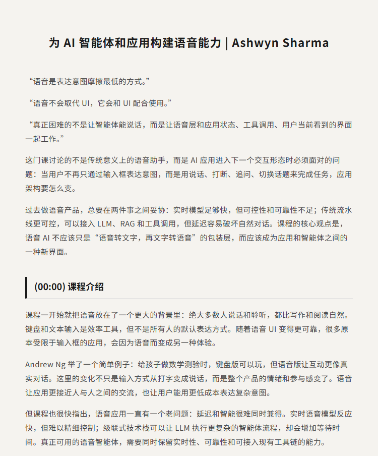
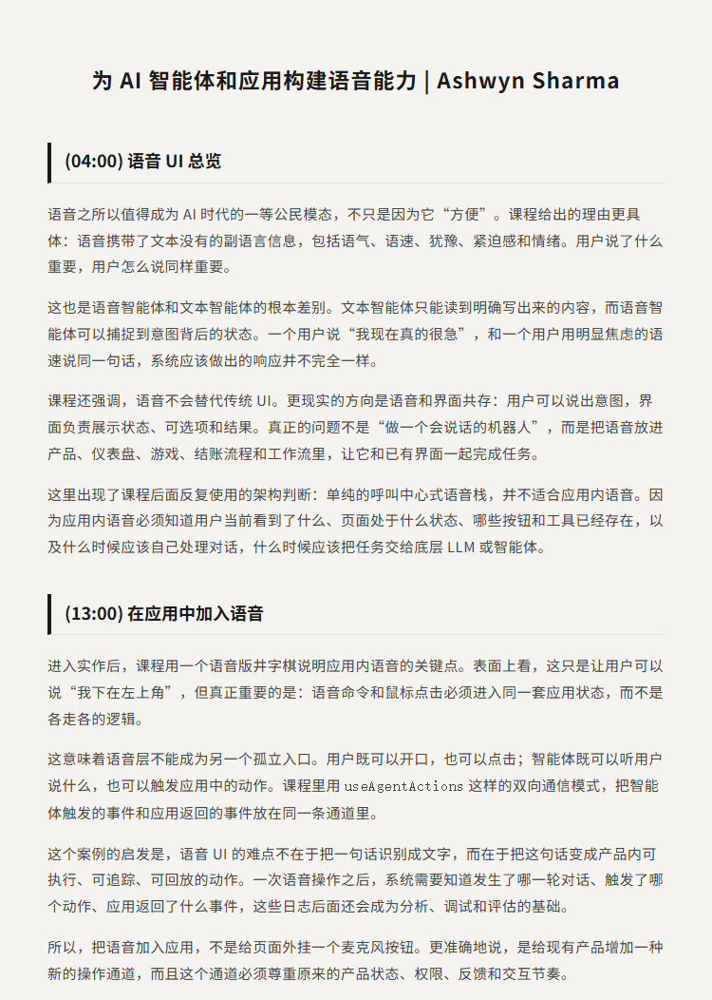
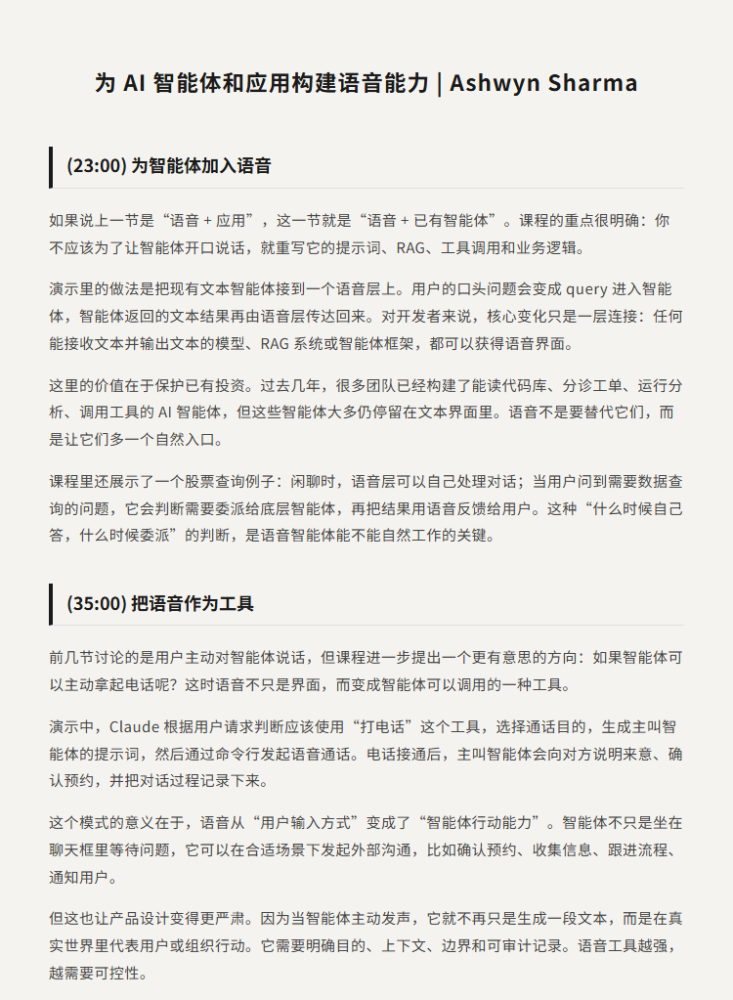
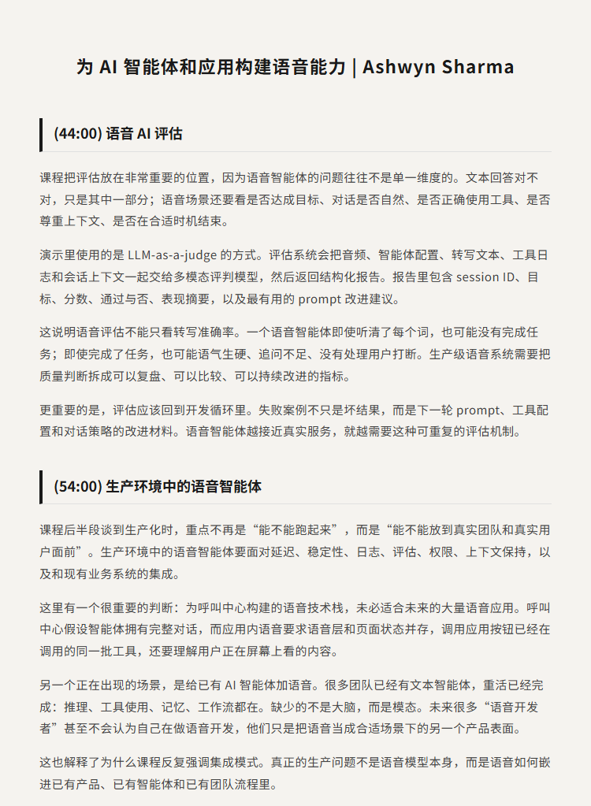
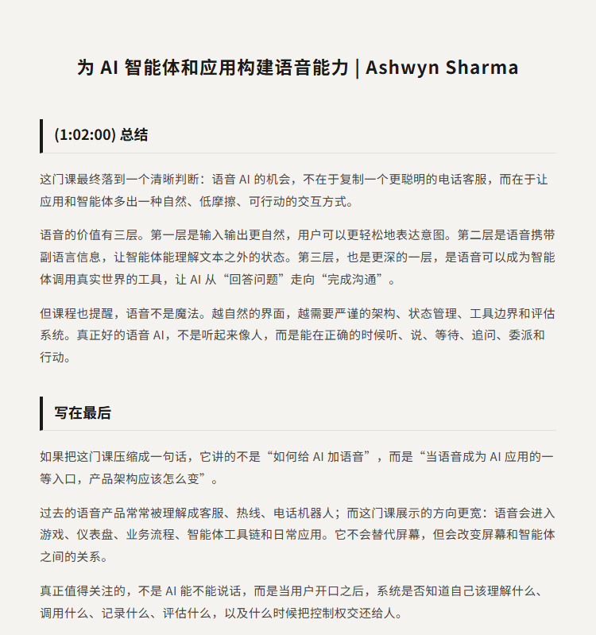

# 为 AI 智能体和应用构建语音能力｜Ashwin Sharma

原视频：Voice for AI Agents and Applications

课程链接：https://www.deeplearning.ai/courses/voice-for-ai-agents-and-applications

B站：https://www.bilibili.com/video/BV1wHen6EE4k/

## 简介

语音是人类最自然的交互方式之一，但把语音加入 AI 应用，并不只是给智能体接一个麦克风。真正的问题是：当用户可以说话、打断、追问、切换话题时，应用状态、工具调用、UI 反馈和底层智能体应该如何协同工作。

这门 DeepLearning.AI 课程由 Vocal Bridge CEO Ashwin Sharma 讲授，围绕三种实用集成模式展开：把语音嵌入应用、给已有文本智能体加一层语音入口，以及把语音变成智能体可以调用的工具。课程还讨论了语音 AI 评估、生产环境中的延迟和可靠性，以及如何把语音层接入现有产品与智能体架构。

适合正在做 AI 应用、语音交互、智能体工具调用、RAG 或生产级 AI 工作流的开发者观看。看完后可以理解：语音 AI 的核心不是“让 AI 会说话”，而是让系统在正确的时候听、说、等待、追问、委派和行动。

## 看点

1. 语音不是简单的输入方式，而是 AI 应用的新交互入口
2. 为什么传统语音栈会在实时性和可靠性之间做妥协
3. 如何把语音命令和鼠标点击放进同一套应用状态
4. 如何给已有文本智能体增加语音层，而不重写提示词、RAG 和工具
5. 如何让智能体把打电话作为一个可调用工具
6. 为什么语音智能体评估不能只看转写准确率
7. 如何用多模态评估、工具日志和会话上下文改进语音交互
8. 生产环境中的语音智能体需要怎样的架构、日志和质量闭环

## 字幕下载

- [双语字幕](subtitles/Voice%20for%20AI%20Agents%20and%20Applications.bilingual.zh-top.srt)

## 中文时间轴

见 [timeline.md](timeline.md)。

## 完整提纲

见 [outline.md](outline.md)。

## 提纲图

- 
- 
- 
- 
- 

## 原始简介

见 [bilibili.md](bilibili.md)。
