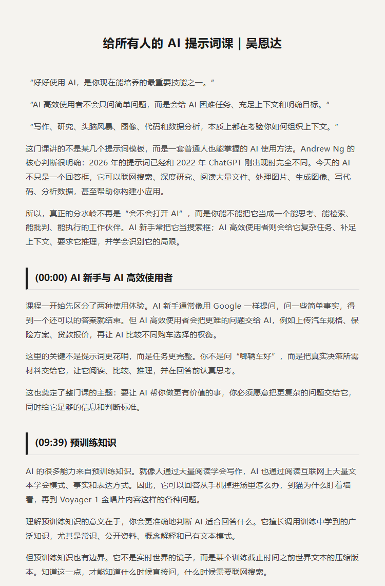
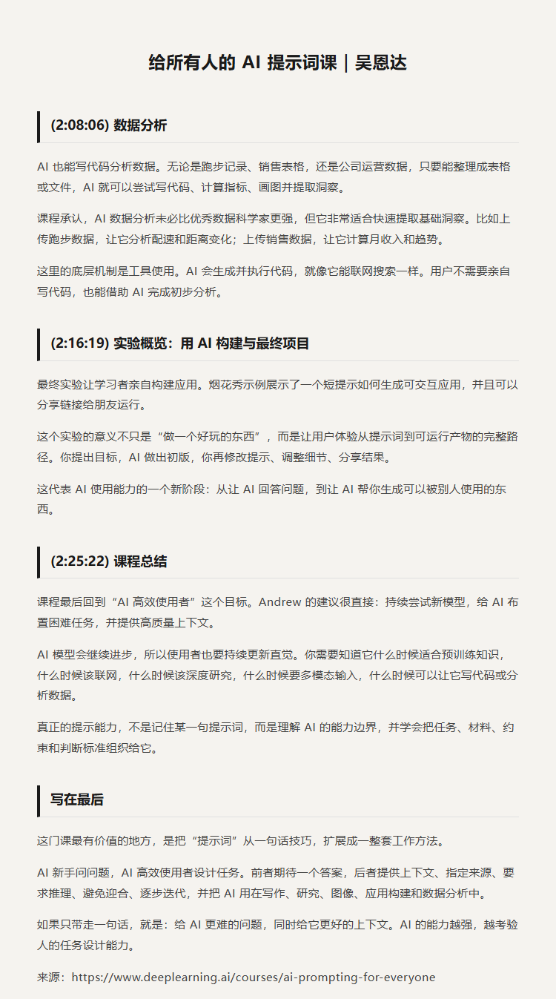

# 给所有人的 AI 提示课｜吴恩达

原视频：AI Prompting for Everyone

课程链接：https://www.deeplearning.ai/courses/ai-prompting-for-everyone

B站：https://www.bilibili.com/video/BV1RNei65EGt/

## 简介

这门课面向所有想更好使用 AI 的人，不要求编程基础。吴恩达会从最常见的 AI 使用误区讲起，解释为什么有的人只能得到泛泛而谈的回答，而 AI 高效使用者能让模型查资料、做推理、给反馈、辅助写作、处理图像和数据，甚至构建简单应用。

课程重点不是传统意义上的“提示词工程”，而是日常工作和学习中真正有用的 AI 使用能力：如何给 AI 足够上下文，如何让它做联网搜索和深度研究，如何避免迎合倾向，如何把 AI 当作思考伙伴，以及如何用 AI 进行写作、评审、多模态创作、应用构建和数据分析。

适合 AI 新手、知识工作者、内容创作者、产品和运营人员，以及希望系统提升 AI 使用效率的人观看。看完后可以理解：好的提示不是写一句神奇咒语，而是清楚地提供目标、背景、约束和判断标准，让 AI 更可靠地参与真实任务。

## 看点

1. AI 新手和 AI 高效使用者在提问方式上的根本差别
2. AI 的预训练知识从哪里来，以及为什么会出现错误
3. 什么时候应该用普通联网搜索，什么时候适合深度研究
4. 如何给 AI 足够上下文，让它成为真正的思考伙伴
5. 为什么要警惕 AI 的迎合倾向，并学会用中立方式提问
6. 如何用 AI 写作、编辑和获得批判性反馈
7. 如何处理图像、音频、视频等多模态输入输出
8. 如何用 AI 构建简单应用并完成数据分析

## 字幕下载

- [双语字幕](subtitles/AI%20Prompting%20for%20Everyone.bilingual.zh-top.srt)

## 中文时间轴

见 [timeline.md](timeline.md)。

## 提纲图

- 
- 
- 
- 
- 
- 

## 原始简介

见 [bilibili.md](bilibili.md)。
