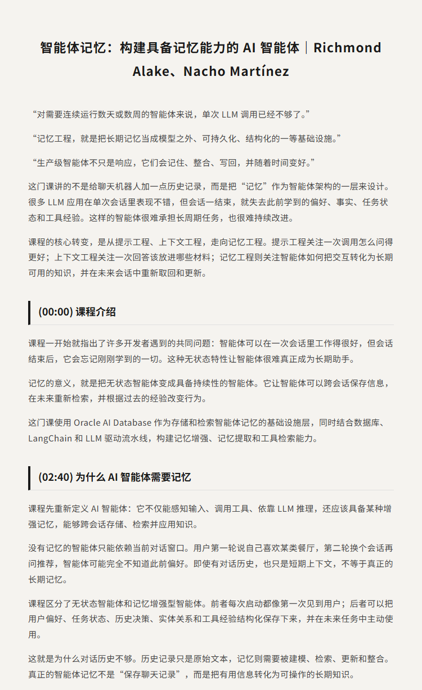
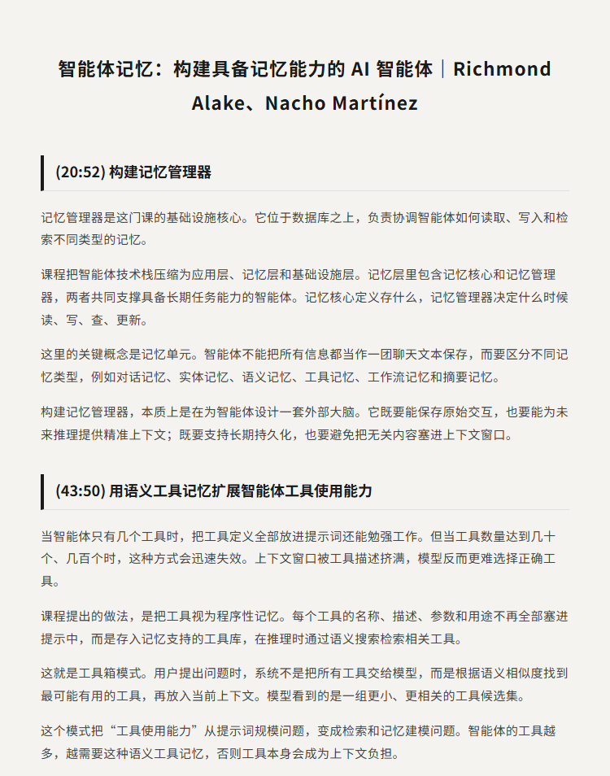
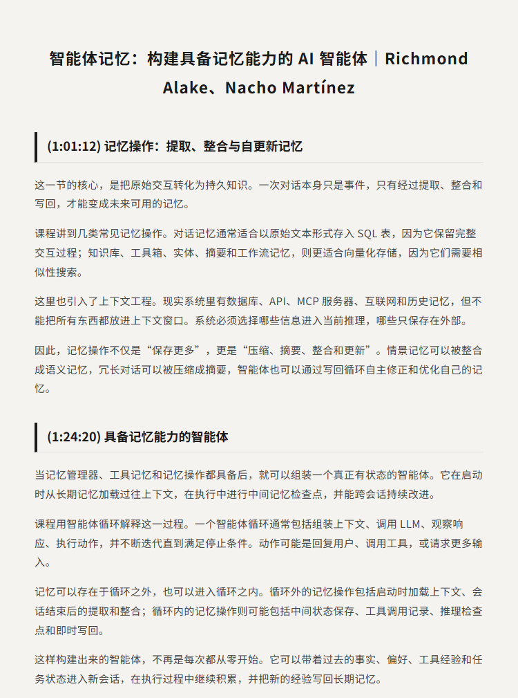
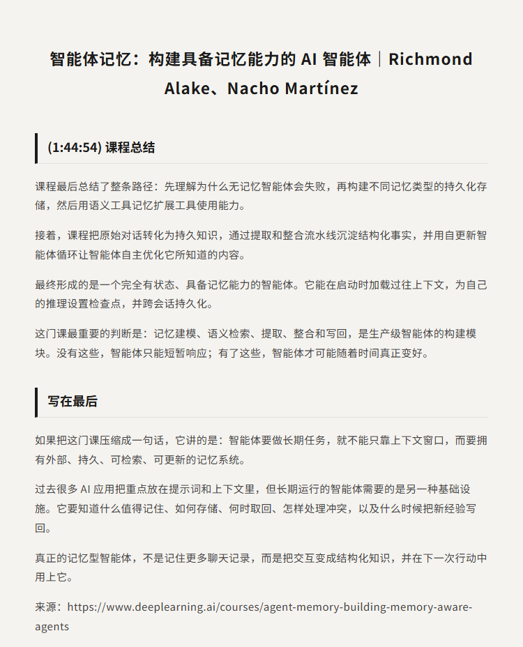

# 智能体记忆：构建具备记忆能力的 AI 智能体｜Richmond Alake、Nacho Martínez

原视频：Agent Memory: Building Memory-Aware Agents

课程链接：https://www.deeplearning.ai/courses/agent-memory-building-memory-aware-agents

B站：https://www.bilibili.com/video/BV1NDez63Ery/

## 简介

这门课讲的是如何让 AI 智能体不再只是“单次会话里看起来聪明”，而是能跨会话保存、检索和更新记忆。很多智能体在一次对话中能完成任务，但会话结束后就会丢失上下文；而具备记忆能力的智能体，可以在之后的交互中继续利用过去的信息、偏好、工具使用经验和任务状态。

课程围绕记忆优先架构展开，使用 Oracle AI Database、LangChain 和 LLM 驱动的流水线，构建一个完整的 Memory-Aware Agent。内容包括无状态智能体的局限、长期记忆的类型、记忆管理器、语义工具记忆、记忆提取与整合、写回循环，以及如何把这些模块组合成一个完全有状态的智能体。

适合正在构建 AI 智能体、RAG 应用、工具调用系统或长期任务自动化工作流的开发者观看。看完后可以理解：智能体记忆不是把所有历史都塞进上下文窗口，而是把记忆建模、持久化存储、语义检索和自更新机制组合成可工程化的基础设施。

## 看点

1. 为什么无状态智能体很难完成长周期任务
2. 如何把长期记忆作为智能体基础设施，而不是临时上下文
3. 课程区分了工作记忆、语义记忆、程序性记忆和情景记忆
4. 记忆管理器如何统一处理不同类型的智能体记忆
5. 为什么不能把所有工具信息都塞进上下文窗口
6. 如何用语义工具记忆扩展智能体的工具使用能力
7. 记忆提取、记忆整合和写回循环如何让智能体持续更新
8. 如何用 Oracle AI Database 构建持久化记忆存储
9. 如何把 LangChain、数据库和 LLM 流水线组合成具备记忆能力的智能体

## 字幕下载

- [双语字幕](subtitles/Agent%20Memory%20Building%20Memory-Aware%20Agents.bilingual.zh-top.srt)

## 中文时间轴

见 [timeline.md](timeline.md)。

## 提纲图

- 
- 
- 
- 

## 原始简介

见 [bilibili.md](bilibili.md)。
